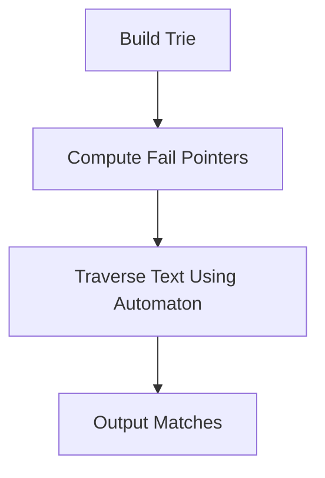

## Overview

Before diving into Aho-Corasick (AC) automaton, many are familiar with single-pattern matching algorithms like KMP and BMH. Both achieve linear time complexity after optimizations, with BMH often performing sublinearly in practice.

The AC automaton elegantly combines a trie (prefix tree) with the KMP-style failure transitions to perform simultaneous multi-pattern matching over a text string, achieving an overall complexity of **O(Σmi + n)**, where *n* is the text length, and *mi* is the length of the *i*-th pattern.

---

## Key Concepts

- **Trie Construction:** Build a prefix tree over all pattern strings.
- **Fail Pointers:** Similar to KMP's `next` array, used to fallback efficiently when mismatch occurs. The fail pointer for each node points to the longest suffix node (which is also a prefix) reachable after mismatch.
- **Matching:** Traverse the text using the trie. Upon mismatch, follow fail pointers without reprocessing characters, ensuring no backtracking on the text.

**Note on Optimization:**

In this implementation, fail pointers are single per node. Further optimization is possible by introducing fail pointers per character branch (`ptr->fail->next[i]`), which can reduce some steps but increase storage cost and complexity.

---

## Algorithm Flow



---

## Compact Comparison Table

| Algorithm | Best For           | Time Complexity          | Remarks                  |
|-----------|--------------------|--------------------------|--------------------------|
| KMP       | Single pattern      | O(n + m)                 | Efficient single match    |
| BMH       | Single pattern      | Average sublinear on text| Practical speed           |
| Aho-Corasick | Multiple patterns | O(Σmi + n)               | Simultaneous multi match |

---

## C++ Implementation

```cpp
#include <iostream>
#include <vector>
#include <queue>
#include <string>
#include <unordered_set>

#define ALPHABET_SIZE 26
using namespace std;

struct TrieNode {
    vector<TrieNode*> next;
    bool isEnd;
    TrieNode* fail;
    TrieNode() : next(ALPHABET_SIZE, nullptr), isEnd(false), fail(nullptr) {}
};

// Build AC Automaton from patterns
TrieNode* buildAutomaton(const vector<string>& patterns) {
    TrieNode* root = new TrieNode();
    // Insert all patterns into trie
    for (const auto& pattern : patterns) {
        TrieNode* node = root;
        for (char ch : pattern) {
            int idx = ch - 'a';
            if (!node->next[idx])
                node->next[idx] = new TrieNode();
            node = node->next[idx];
        }
        node->isEnd = true;
    }

    // Build fail pointers
    queue<TrieNode*> q;
    root->fail = nullptr;
    q.push(root);
    while (!q.empty()) {
        TrieNode* curr = q.front(); q.pop();
        for (int i = 0; i < ALPHABET_SIZE; ++i) {
            TrieNode* child = curr->next[i];
            if (!child) continue;

            TrieNode* f = curr->fail;
            while (f && !f->next[i]) {
                f = f->fail;
            }
            child->fail = f ? f->next[i] : root;
            q.push(child);
        }
    }
    return root;
}

// Search patterns in text
int matchPatterns(const TrieNode* root, const string& text, vector<string>& matchedPatterns, const vector<string>& patterns) {
    int count = 0;
    TrieNode* node = const_cast<TrieNode*>(root);
    unordered_set<TrieNode*> found;

    for (char ch : text) {
        int idx = ch - 'a';
        while (node && !node->next[idx]) {
            node = node->fail;
        }
        node = node ? node->next[idx] : const_cast<TrieNode*>(root);

        TrieNode* temp = node;
        while (temp && temp->isEnd) {
            if (found.find(temp) == found.end()) {
                found.insert(temp);
                ++count;
            }
            temp = temp->fail;
        }
    }

    // Collect matched patterns (brute force due to pointer mapping limitation)
    // In real applications, nodes should hold pattern IDs for direct retrieval
    for (const auto& pattern : patterns) {
        TrieNode* cur = const_cast<TrieNode*>(root);
        bool matched = false;
        for (char ch : pattern) {
            int idx = ch - 'a';
            if (!cur->next[idx]) {
                matched = false;
                break;
            }
            cur = cur->next[idx];
        }
        if (found.find(cur) != found.end()) {
            matchedPatterns.push_back(pattern);
        }
    }
    return count;
}

int main() {
    vector<string> patterns = {"he", "she", "his", "hers"};
    string text = "ahishers";
    vector<string> matchedPatterns;

    TrieNode* root = buildAutomaton(patterns);
    int count = matchPatterns(root, text, matchedPatterns, patterns);
    cout << "Number of matched patterns: " << count << "\n";
    cout << "Matched patterns:\n";
    for (const auto& p : matchedPatterns)
        cout << " - " << p << "\n";

    return 0;
}
```

---

## Notes

- The solution demonstrated simplifies storage by not assigning pattern IDs to nodes; real-world implementations should store IDs or indices in `TrieNode` to avoid the costly reverse lookup.
- Fail pointer optimizations can reduce state transitions but at a memory tradeoff.

This approach remains a core algorithm in dictionary matching, spam filters, and bioinformatics pattern search tasks.
