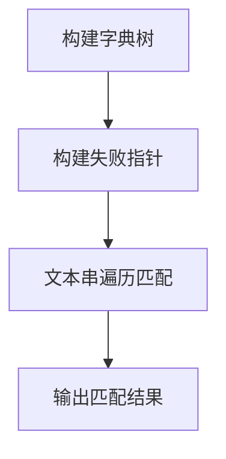

## 概述

在接触AC自动机之前，常见的字符串匹配算法有单模式匹配的KMP和BMH。它们经过优化后，均能达到线性时间复杂度，其中BMH在实际应用中通常表现出亚线性时间。

AC自动机是一种结合字典树和KMP失配指针思想的多模式匹配算法，能在时间复杂度为 **O(Σmi + n)**（其中n为文本长度，mi为第i个模式串长度）内完成多模式匹配。

---

## 核心思想

- **字典树构建：** 将所有模式串构造为一个前缀树。
- **失败指针（fail指针）：** 类似KMP中`next`数组，fail指针指向最长的匹配前缀的后缀节点，用于失配时快速跳转。
- **匹配过程：** 对文本串进行遍历，遇到失配时通过fail指针跳转，无需回溯文本指针。

**关于优化：**
当前实现的fail指针为单指针，进一步优化可为每条边维护对应fail指针（`ptr->fail->next[i]`），虽然减少匹配步骤，但会增加存储开销。

---

## 算法流程



---

## 简明对比表

| 算法      | 适用场景     | 时间复杂度           | 备注                 |
|-----------|--------------|----------------------|----------------------|
| KMP       | 单模式匹配   | O(n + m)             | 单模式高效匹配       |
| BMH       | 单模式匹配   | 平均亚线性           | 实际性能优越         |
| AC自动机  | 多模式匹配   | O(Σmi + n)           | 多模式同时匹配       |

---

## C++代码示例

```cpp
#include <iostream>
#include <vector>
#include <queue>
#include <string>
#include <unordered_set>

#define ALPHABET_SIZE 26
using namespace std;

struct TrieNode {
    vector<TrieNode*> next;
    bool isEnd;
    TrieNode* fail;
    TrieNode() : next(ALPHABET_SIZE, nullptr), isEnd(false), fail(nullptr) {}
};

TrieNode* buildAutomaton(const vector<string>& patterns) {
    TrieNode* root = new TrieNode();
    for (const auto& pattern : patterns) {
        TrieNode* node = root;
        for (char ch : pattern) {
            int idx = ch - 'a';
            if (!node->next[idx])
                node->next[idx] = new TrieNode();
            node = node->next[idx];
        }
        node->isEnd = true;
    }

    queue<TrieNode*> q;
    root->fail = nullptr;
    q.push(root);

    while (!q.empty()) {
        TrieNode* curr = q.front(); q.pop();
        for (int i = 0; i < ALPHABET_SIZE; ++i) {
            TrieNode* child = curr->next[i];
            if (!child) continue;

            TrieNode* f = curr->fail;
            while (f && !f->next[i]) {
                f = f->fail;
            }
            child->fail = f ? f->next[i] : root;
            q.push(child);
        }
    }
    return root;
}

int matchPatterns(const TrieNode* root, const string& text, vector<string>& matchedPatterns, const vector<string>& patterns) {
    int count = 0;
    TrieNode* node = const_cast<TrieNode*>(root);
    unordered_set<TrieNode*> found;

    for (char ch : text) {
        int idx = ch - 'a';
        while (node && !node->next[idx]) {
            node = node->fail;
        }
        node = node ? node->next[idx] : const_cast<TrieNode*>(root);

        TrieNode* temp = node;
        while (temp && temp->isEnd) {
            if (found.find(temp) == found.end()) {
                found.insert(temp);
                ++count;
            }
            temp = temp->fail;
        }
    }

    // 由于未在节点中存储模式串ID，采用暴力匹配挖掘结果
    for (const auto& pattern : patterns) {
        TrieNode* cur = const_cast<TrieNode*>(root);
        bool matched = true;
        for (char ch : pattern) {
            int idx = ch - 'a';
            if (!cur->next[idx]) {
                matched = false;
                break;
            }
            cur = cur->next[idx];
        }
        if (matched && found.find(cur) != found.end()) {
            matchedPatterns.push_back(pattern);
        }
    }
    return count;
}

int main() {
    vector<string> patterns = {"he", "she", "his", "hers"};
    string text = "ahishers";
    vector<string> matchedPatterns;

    TrieNode* root = buildAutomaton(patterns);
    int count = matchPatterns(root, text, matchedPatterns, patterns);
    cout << "匹配到的模式串数量: " << count << "\n";
    cout << "匹配到的模式串列表:\n";
    for (const auto& p : matchedPatterns)
        cout << " - " << p << "\n";

    return 0;
}
```

---

## 备注

- 本文代码中未直接在Trie节点存储模式串ID，真实场景建议存储以快速定位匹配。
- fail指针的进一步优化可减少匹配步骤，但增加空间消耗。

AC自动机是多模式匹配领域的经典算法，广泛应用于网络安全、文本搜索及生物信息学领域。
