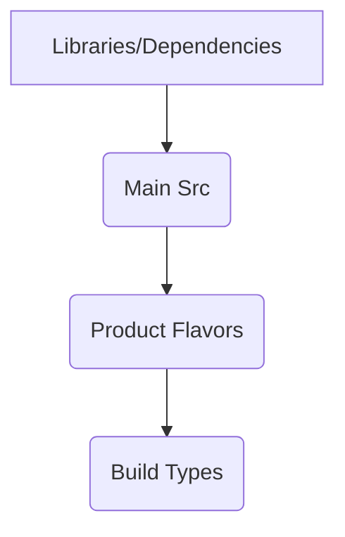

## 0. Introduction
This article is adapted from [9 Things You Need to Know About Android Studio](http://www.yiqivr.com/2014/12/you-should-know-the-things-about-android-studio/), capturing the essentials of early Android Studio usage.

---

## 1. Building Your Project
Use the menu: **Build > Make Project**. Monitor build output in the **Gradle Console** (bottom-right panel).

---

## 2. Using Gradle Tasks
Open the **Gradle** sidebar, expand your project and then `:app` module to see available tasks. For example:

- Double-click `assembleRelease` to build a release APK.
- Double-click `assemble` to build both debug and release APKs, placed in `app/build/outputs/apk/`.

**APK Naming Convention:**

```plaintext
app-<flavor>-<buildtype>.apk
```

Example: `app-full-release.apk`, `app-demo-debug.apk`.

You can also run Gradle commands in the console. For example:

```bash
gradle tasks  # Lists all tasks
gradle build  # Equivalent to 'assemble' + 'check'
gradle aR     # Shorthand for 'assembleRelease'
```

---

## 3. Run Configurations
Navigate to **Run > Edit Configurations** and expand **Android Application**. Here you can:

- Create or edit run configurations.
- Configure whether to auto-start the default Activity or a specific Activity.
- Choose deployment targets, including auto-deploy to connected USB devices (physical devices).

### Emulator Network Speed Profiles
| Profile | Description                        | Latency (min - max, ms)    |
|---------|----------------------------------|----------------------------|
| None    | No latency                       | 0                          |
| GPRS    | GPRS                             | 150 - 550                  |
| EDGE    | EDGE/EGPRS                      | 80 - 400                   |
| UMTS    | UMTS/3G                         | 35 - 200                   |

You can also add extra emulator command-line flags, e.g., to scale DPI:

```bash
-scale 96dpi
```

Configure **logcat** options such as automatic clearing on each launch.

---

## 4. Running Your App
Click **Run > Run** (or **Debug**).

The process includes:
1. Compiling the project.
2. Creating or using an existing run configuration.
3. Installing and running on the selected device.

### Deploying to a Physical Device
- Ensure `android:debuggable` is `true` in your app's `<application>` tag in `AndroidManifest.xml` (optional in recent versions).
- Enable USB debugging on the device. For Android versions:
  - <= 3.2: `Settings > Applications > Development`
  - >= 4.0: `Settings > Developer options`
  - >= 4.2: Developer options hidden by default, enable by tapping **Build Number** 7 times under `Settings > About phone`.

---

## 5. Command Line Usage
Build debug APK:

```bash
chmod +x gradlew  # Only once to enable execution
./gradlew assembleDebug
```

APK location after build: `app/build/outputs/apk/`.

Build release APK:

```bash
./gradlew assembleRelease
```

**Note:** Release APKs are unsigned initially; manual signing or automatic signing via Gradle is required.

### Automatic Signing Setup (in `build.gradle`)
Add signingConfigs with keystore parameters such as `storeFile`, `storePassword`, `keyAlias`, `keyPassword`.

Alternatively configure signing via **Project Structure > Signing** GUI, which auto-generates Gradle configs.

Running `assembleRelease` afterwards produces a signed and zipaligned release APK.

Install on device/emulator via:

```bash
adb install <path_to_your_apk>.apk
```

---

## 6. Gradle Build Configuration
Gradle build files use Groovy DSL to define the build logic.

Key configuration areas:

| Feature           | Purpose                                        |
|-------------------|------------------------------------------------|
| Build variants    | Generate multiple APK versions from one module |
| Dependencies      | Declare local & remote libraries & modules     |
| Manifest entries  | Control version code, application IDs, etc.    |
| Signing           | Define keystore and signing config              |
| ProGuard          | Configure code obfuscation and optimization    |
| Testing           | Integrated unit and instrumentation testing    |

---

## 7. Projects and Modules
- An Android project contains one or more modules.
- Each module encapsulates code and resources, can be independently built & tested.

### Module Types
| Type                 | Description                                  |
|----------------------|----------------------------------------------|
| Android application  | Main app modules: Mobile, TV, Wear, Glass   |
| Android library      | Reusable components packaged as AAR          |
| App Engine modules   | Modules with backend integration code        |
| Java library modules | Reusable Java code packaged as JAR            |

### Project-Level `build.gradle`
Defines global Gradle repositories and plugin dependencies, e.g.:

```groovy
buildscript {
    repositories {
        jcenter()
    }
    dependencies {
        classpath 'com.android.tools.build:gradle:0.14.4'
        // Application dependencies go in module build.gradle
    }
}
allprojects {
    repositories {
        jcenter()
    }
}
```

SDK location is set in `local.properties` via `sdk.dir`.

### Module-Level `build.gradle`
Typical configuration:

```groovy
apply plugin: 'com.android.application'

android {
    compileSdkVersion 20
    buildToolsVersion '20.0.0'

    defaultConfig {
        applicationId 'com.mycompany.myapplication'
        minSdkVersion 13
        targetSdkVersion 20
        versionCode 1
        versionName '1.0'
    }

    buildTypes {
        release {
            minifyEnabled false
            proguardFiles getDefaultProguardFile('proguard-android.txt'), 'proguard-rules.pro'
        }
        debug {
            debuggable true
        }
    }
}

dependencies {
    compile fileTree(dir: 'libs', include: ['*.jar'])
    compile 'com.android.support:appcompat-v7:20.0.0'
    compile project(path: ':app2', configuration: 'android-endpoints')
}
```

---

## 8. Dependency Management
Supports three types:

| Dependency Type      | Syntax Example                               |
|----------------------|----------------------------------------------|
| Module dependency    | `compile project(':libraries:lib1')`         |
| Local binary (JAR/AAR)| `compile fileTree(dir: 'libs', include: ['*.jar'])` |
| Remote binary        | `compile 'com.google.guava:guava:16.0.1'`      |

**Module dependencies** use Gradle paths reflecting folder structure:

```
MyProject/
|-- app/
|-- libraries/
    |-- lib1/
    |-- lib2/
```

Configured in `settings.gradle` as:

```groovy
include ':app', ':libraries:lib1', ':libraries:lib2'
```

---

## 9. Build Variants
A **build variant** is a combination of one **build type** and one **product flavor**.

| Concept         | Description                                                                           |
|-----------------|---------------------------------------------------------------------------------------|
| Build Types     | E.g., `debug`, `release`, defining optimization, debugging and obfuscation settings   |
| Product Flavors | Custom dimensions like `demo` vs `full`, CPU architecture, etc.                      |

Typical default variants without flavors:
- debug
- release

Adding two flavors: demo, full yields four variants:
- demoDebug
- demoRelease
- fullDebug
- fullRelease

Further adding ABI flavors (e.g. x86, arm, mips) expands to 12 variants total.

### Source Set Organization
Android Studio merges source sets for each variant in priority:



Source folders:

| Folder             | Purpose                         |
|--------------------|--------------------------------|
| src/main/          | Common sources across variants  |
| src/<buildType>/    | Build type specific sources     |
| src/<productFlavor>/| Flavor specific sources         |

Example:
```
src/main/
src/release/
src/demo/
src/arm/
```

Files with the same name can coexist if they belong to non-overlapping source sets.

Manifests from all source sets are merged following the same priority rules.

### Build Variant Commands
Execute Gradle tasks:

```bash
assemble<VariantName>       # e.g. assembleDemoDebug
assemble<BuildTypeName>     # e.g. assembleDebug (builds all debug variants)
assemble<ProductFlavorName> # e.g. assembleDemo (builds debug and release for Demo)
```

---

*This guide preserves the 2014 era context of Android Studio, Gradle plugin versions, and project structures while improving readability and contemporary clarity.*
