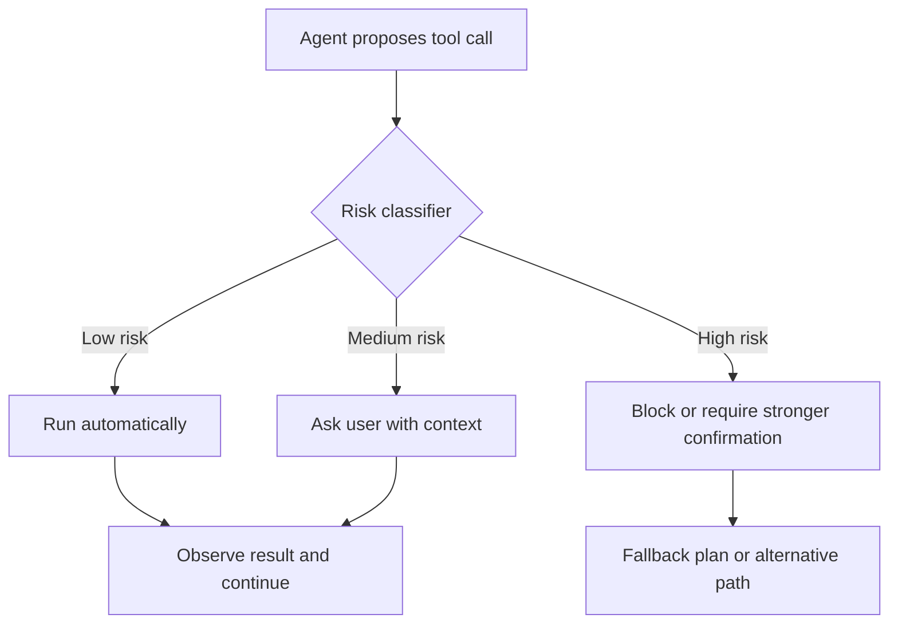

## The interesting part is not convenience

Anthropic's March 24, 2026 note on Claude Code auto mode is easy to misread as a UX update. It is much more important than that.

The interesting move is not "fewer permission popups." The interesting move is that the product stops treating trust as a binary switch.

For a long time, agent tooling has oscillated between two bad defaults:

| Mode | What it optimizes | What usually goes wrong |
|---|---|---|
| Ask for everything | Safety by friction | The agent becomes slow, annoying, and underpowered |
| Full access | Speed by trust | One bad command becomes a real operational incident |

Auto mode points to a third model: **runtime governance**.

> The right interface is not "trust the model" or "never trust the model." It is "classify the action, then decide how much trust this action deserves."

## Why this matters

The product idea is subtle but strong. Instead of making the human pre-approve an entire session, the system judges each meaningful action at execution time.

That shift matters because risk is not evenly distributed. Editing a local README, deleting a production directory, and pushing to a remote branch are not three versions of the same act. They belong to different risk classes and deserve different handling.

In other words, agent UX is becoming policy UX.



Once you see the loop this way, auto mode stops looking like a convenience feature and starts looking like infrastructure for serious agent use.

## The boundary that matters

The right boundary is not the prompt window. It is the **tool call**.

That is where the system has enough information to decide well:

- what tool is being invoked;
- what resource is being touched;
- whether the operation is destructive, external, or reversible;
- whether the result can be checked after execution.

This is a much more defensible control point than trying to infer risk from a long natural-language conversation.

A practical policy model often looks more like this than like a grand theory:

```yaml
policies:
  read_local_files: allow
  edit_workspace_files: allow_with_logging
  create_git_commit: ask
  push_remote_branch: ask
  delete_many_files: deny
  shell_with_network_and_write: escalate
```

That may not feel glamorous, but it is exactly the kind of boring machinery that turns a demo into a durable product.

## The product lesson

The strongest part of the idea is not technical cleverness. It is product taste.

Good agent products should not force users to choose between **paralysis** and **recklessness**. They should compress routine safe work while keeping a visible brake on irreversible moves.

That leads to three design principles:

1. **Speed belongs on the safe path.** Low-risk work should feel fluid.
2. **Escalation belongs at meaningful edges.** Confirmation prompts should appear where consequences change, not everywhere.
3. **Fallback matters as much as permissioning.** If the system blocks an action, it should help the agent recover instead of just saying no.

This is why I think auto mode matters. It is an early example of an agent interface growing out of operational reality rather than chatbot nostalgia.

## My current takeaway

As agents become more capable, the real product competition will not be "who has the smartest model." It will be "who has the cleanest runtime contract between autonomy and control."

The winning systems will treat governance as part of the interaction model:

- classification instead of blanket trust,
- scoped capability instead of vague permission,
- graceful escalation instead of brittle interruption,
- observable logs instead of invisible magic.

That is the direction I would bet on. Not maximal autonomy. **Governed autonomy.**

## References

- [Auto mode for Claude Code](https://claude.com/blog/auto-mode)
