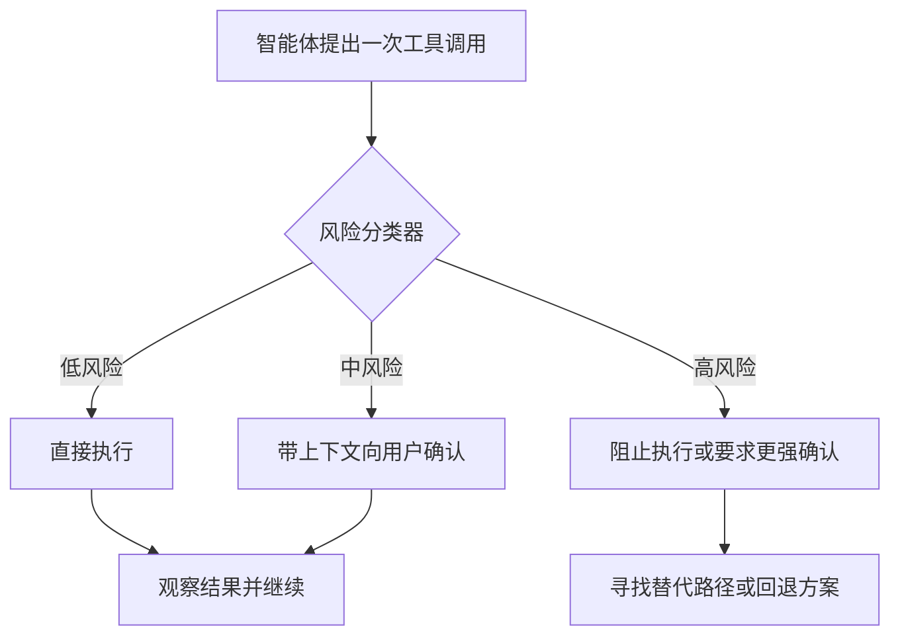

## 关键不在于“更方便”

Anthropic 在 2026 年 3 月 24 日发布的 Claude Code auto mode，很容易被误读成一次体验优化。但它真正有意思的地方，远不只是“少点几次确认框”。

真正重要的变化是：产品不再把信任理解成一个二元开关。

过去一段时间，智能体工具经常在两个糟糕的默认值之间摇摆：

| 模式 | 优化目标 | 常见问题 |
|---|---|---|
| 事事都问 | 用摩擦换安全 | 智能体变慢、变吵、能力被削弱 |
| 全权放开 | 用信任换速度 | 一次错误命令就可能升级成真实事故 |

Auto mode 指向的是第三种模型：**运行时治理**。

> 正确的界面不是“完全信任模型”或“永远不信任模型”，而是“先判断动作的风险等级，再决定这个动作配得上多少信任”。

## 为什么这件事重要

这个产品思路的强度，在于它放弃了“会话级预授权”的粗暴模型，转而在执行时逐个判断动作。

这很重要，因为风险并不是均匀分布的。修改本地 README、删除一个生产目录、向远端仓库推送分支，这三件事绝不该被视为同一类操作。

换句话说，agent UX 正在变成 policy UX。



一旦从这个角度去看，auto mode 就不再像一个“减少打断”的小功能，而更像一层面向严肃智能体工作的基础设施。

## 真正重要的边界

真正的边界不是聊天窗口，而是 **tool call**。

因为到了这一层，系统终于掌握了足够的信息：

- 调用的是哪一种工具；
- 触碰的是哪一类资源；
- 这个动作是否具备破坏性、外部性或不可逆性；
- 执行完成之后，结果能否被验证。

这比从一整段自然语言对话里“猜风险”要稳健得多。

一个实用的策略模型，通常更像下面这样，而不是一套空泛口号：

```yaml
policies:
  read_local_files: allow
  edit_workspace_files: allow_with_logging
  create_git_commit: ask
  push_remote_branch: ask
  delete_many_files: deny
  shell_with_network_and_write: escalate
```

它看起来不炫，但正是这种朴素的治理机械，决定了一个产品是 demo 还是系统。

## 产品层面的启发

我觉得这个思路最强的地方，并不在“技术炫技”，而在于产品判断力。

好的智能体产品，不应该逼用户在 **瘫痪** 和 **鲁莽** 之间二选一。它应该把低风险路径压缩得足够顺滑，同时在不可逆的边界上保留清晰刹车。

这会导出三个设计原则：

1. **速度应该留给安全路径。** 低风险动作就该流畅。
2. **升级确认应该出现在真正的边界上。** 提示框应该出现在后果发生变化的地方，而不是到处弹。
3. **回退能力和授权能力同样重要。** 如果系统阻止了一个动作，它还应该帮助智能体继续完成任务，而不是只会说“不行”。

这也是为什么我认为 auto mode 值得认真看待。它是少数从运行现实长出来的 agent 交互形态，而不是从聊天产品的惯性里长出来的。

## 我的判断

随着智能体能力继续提升，真正的产品竞争不会只是“谁的模型更聪明”，而会变成“谁能建立更干净的运行时契约，把自主性和控制权连接起来”。

胜出的系统，会把治理内建进交互模型里：

- 用分类替代一刀切信任；
- 用作用域明确的能力替代模糊授权；
- 用平滑升级替代脆弱打断；
- 用可观察日志替代不可见魔法。

我更看好这个方向。不是最大化自治，而是 **被治理的自治**。

## 参考

- [Auto mode for Claude Code](https://claude.com/blog/auto-mode)
