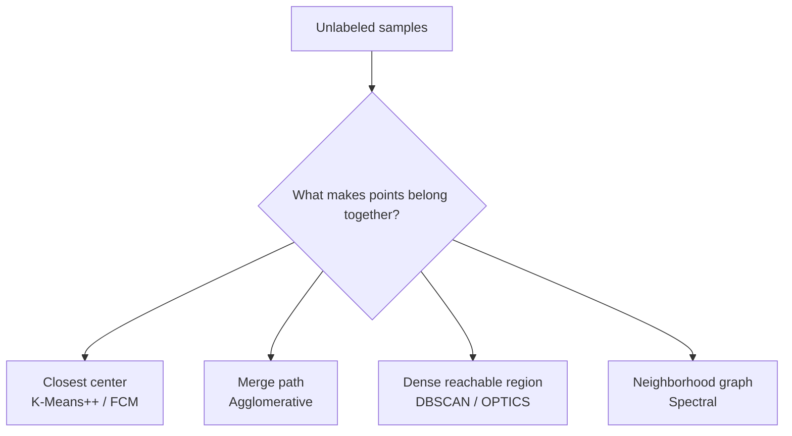

# Clustering Is Really a Definition Problem

> The hard part of clustering is not choosing a library call. It is deciding what you mean by "belong together".

Most introductions present clustering as a menu of algorithms: K-Means++, Fuzzy C-Means, Hierarchical Clustering, DBSCAN, OPTICS, Spectral Clustering. That is technically correct but strategically weak. In practice, the first decision is not _which algorithm is popular_, but _which notion of neighborhood, prototype, density, or graph structure matches the data-generating process_.

This is also why the refreshed `clustering-playbook` repository is more useful than the original 2019 note. The old article explained several classic methods well enough for study. The new repository turns them into a small, runnable decision system: consistent Python scripts, shared utilities, smoke tests, and a cleaner comparison across prototype-based, density-based, hierarchical, and graph-based views of a cluster.

## A Better Mental Model



The diagram matters because it reframes clustering from "algorithm selection" to "structure selection." Each family encodes a different belief about the world:

- **Prototype methods** assume a cluster can be summarized by a center.
- **Hierarchical methods** assume the merge history itself carries signal.
- **Density methods** assume clusters are connected regions separated by sparse space.
- **Graph methods** assume local neighborhood relationships matter more than global geometry.

If that belief is wrong, parameter tuning becomes theater.

## Comparing the Main Families

| Family | Best fit | Fails when | Primary trade-off |
| --- | --- | --- | --- |
| **K-Means++** | Compact, blob-like groups with known `k` | Shapes are curved, nested, or noisy | Fast and interpretable, but geometrically opinionated |
| **Fuzzy C-Means** | Overlap matters and soft membership is useful | Noise is heavy or `k` is unknown | More expressive assignments, same center-based bias |
| **Agglomerative** | You care about coarse-to-fine structure | Data is large or early merges mislead | Rich hierarchy, weak scalability |
| **DBSCAN / OPTICS** | Irregular shapes and outliers matter | Density varies wildly without careful handling | Noise-aware clustering, harder parameter intuition |
| **Spectral Clustering** | A similarity graph captures structure better than distance to a center | Scale is large or graph construction is unstable | Elegant on non-convex manifolds, expensive and sensitive |

The real engineering move is to treat this table as a constraint map, not a popularity ranking.

## What Improved Since the Original Article

The original post was strong on algorithm walkthroughs. Its limitation was common to many early technical blogs: it treated algorithms mostly as isolated techniques. The modern repository is better because it turns the subject into a comparative learning surface.

Three upgrades matter:

1. **Runnable consistency.** Scripts share parameters such as `--seed`, `--samples`, `--output`, and `--show`, which makes comparison operational rather than rhetorical.
2. **Expanded coverage.** Adding OPTICS and Spectral Clustering fixes an important gap: not all hard clustering problems are center-finding problems.
3. **Repository-level quality.** Shared utilities, smoke tests, and CI make the material feel like maintainable engineering knowledge rather than a one-off note.

That shift is subtle but important. A good technical article explains an algorithm. A better technical artifact also teaches how to compare, run, and falsify it.

## Practical Selection Heuristics

If you remember only one rule, remember this:

**Choose the algorithm family by the failure mode you can tolerate.**

- If forcing every point into a cluster is acceptable, start with **K-Means++**.
- If ambiguity is part of the problem, move to **Fuzzy C-Means**.
- If the hierarchy itself is valuable, use **Agglomerative Clustering**.
- If outliers are first-class citizens, begin with **DBSCAN** and escalate to **OPTICS** when one global density threshold is too crude.
- If clusters look like rings, moons, or graph communities, consider **Spectral Clustering** before wasting time on centroid methods.

A second rule is equally practical: **parameter tuning should refine an already plausible worldview, not rescue a broken one**.

## From Explanation to Use

The repository's small command-line surface is a good example of tasteful teaching design:

```bash
python3 k_means_plus_plus.py --samples 320 --clusters 4 --output k_means_plus_plus.png
python3 dbscan.py --samples 320 --eps 0.16 --min-samples 6 --output dbscan.png
python3 spectral_clustering.py --samples 320 --clusters 2 --neighbors 10 --output spectral.png
```

That matters because it shortens the loop between "I think this family matches my data" and "I can test that belief in minutes." In applied machine learning, shorter feedback loops usually beat more ornate theory.

## Closing View

Clustering is often introduced as unsupervised grouping. A better description is this: it is the art of imposing a useful geometry on unlabeled data.

Once you see that, the repository becomes more than a tutorial set. It becomes a compact playbook for asking the right question before choosing the wrong algorithm.
