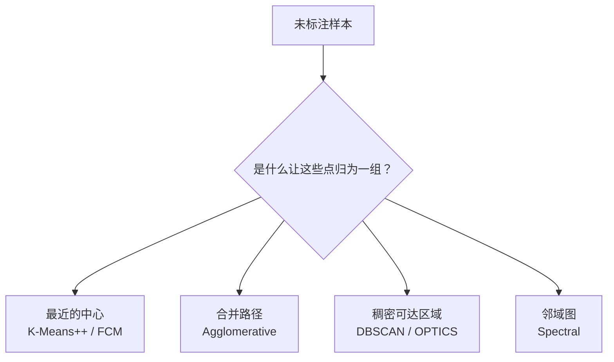

# 聚类本质上是一个定义问题

> 聚类真正困难的部分，不是选择哪个库调用，而是决定你所说的“归为一类”到底是什么意思。

大多数入门材料都会把聚类介绍成一份算法菜单：K-Means++、模糊 C 均值、层次聚类、DBSCAN、OPTICS、谱聚类。从技术上说这没错，但从策略上看却很薄弱。在实践中，第一个决策并不是 _哪种算法更流行_，而是 _哪一种邻域、原型、密度或图结构的概念，才真正符合数据的生成过程_。

这也正是为什么重新整理后的 `clustering-playbook` 仓库比 2019 年最初那篇笔记更有用。旧文章对几种经典方法的讲解足以用于学习；而新的仓库则把它们变成了一个小型、可运行的决策系统：统一风格的 Python 脚本、共享工具函数、冒烟测试，以及在基于原型、基于密度、层次化和基于图的聚类视角之间更清晰的对比。

## 更好的思维模型



这张图之所以重要，是因为它把聚类从“算法选择”重新框定为“结构选择”。每个方法家族都蕴含着一种不同的世界观：

- **原型方法** 假设一个簇可以用一个中心来概括。
- **层次方法** 假设合并历史本身就携带信号。
- **密度方法** 假设簇是由稀疏空间分隔开的连通区域。
- **图方法** 假设局部邻域关系比全局几何形状更重要。

如果这种假设错了，参数调优就只是在做样子。

## 主要算法家族对比

| 算法家族 | 最适用场景 | 何时失效 | 主要权衡 |
| --- | --- | --- | --- |
| **K-Means++** | 已知 `k` 的紧凑、团块状簇 | 簇形弯曲、嵌套，或噪声较大 | 速度快、可解释性强，但几何偏见明显 |
| **模糊 C 均值** | 簇间重叠很重要，且软归属有价值 | 噪声较重或 `k` 未知 | 归属表达力更强，但同样带有基于中心的偏置 |
| **凝聚式层次聚类** | 需要从粗到细的层次结构 | 数据规模大，或早期合并会误导后续结构 | 层次丰富，但可扩展性较弱 |
| **DBSCAN / OPTICS** | 不规则形状和离群点都重要 | 密度差异极大且处理不当 | 能感知噪声，但参数更难直观设定 |
| **谱聚类** | 相似度图比到中心的距离更能捕捉结构 | 规模很大，或图构建不稳定 | 在非凸流形上很优雅，但代价高且敏感 |

真正的工程化思路，是把这张表当作约束地图，而不是流行度排行榜。

## 相较原始文章的改进

原始文章在算法讲解方面很扎实。它的局限也很典型，许多早期技术博客都有这个问题：它主要把算法当作彼此孤立的技巧来介绍。如今的仓库更好，因为它把这个主题变成了一个可供比较学习的平台。

有三项升级尤为重要：

1. **可运行的一致性。** 各个脚本共享 `--seed`、`--samples`、`--output` 和 `--show` 等参数，使比较不再停留在口头层面，而是成为可操作的实践。
2. **覆盖范围扩展。** 新增 OPTICS 和谱聚类补上了一个重要空白：并非所有硬聚类问题都是寻找中心的问题。
3. **仓库级质量。** 共享工具、冒烟测试和 CI 让这些内容更像可维护的工程知识，而不是一次性的随手笔记。

这种转变很微妙，却很重要。一篇好的技术文章会解释一种算法。一个更好的技术产物，还会教你如何比较、运行并证伪它。

## 实用选型经验法则

如果你只记住一条规则，那就记住这一条：

**根据你能容忍的失败模式来选择算法家族。**

- 如果可以接受把每个点都强制分到某个簇中，就从 **K-Means++** 开始。
- 如果模糊性本身就是问题的一部分，就转向 **模糊 C 均值（Fuzzy C-Means）**。
- 如果层次结构本身就有价值，就使用 **凝聚层次聚类（Agglomerative Clustering）**。
- 如果离群点是一等公民，就先从 **DBSCAN** 开始；当单一的全局密度阈值过于粗糙时，再升级到 **OPTICS**。
- 如果簇呈现出环形、月牙形或图社区这类结构，那么在把时间浪费在基于质心的方法上之前，先考虑 **谱聚类（Spectral Clustering）**。

第二条规则同样实用：<u>参数调优应该是在一个本来就说得通的认知框架上做细化，而不是去挽救一个从根上就错了的框架</u>。

## 从解释到使用

这个仓库简洁的命令行接口，是教学设计拿捏得当的一个好例子：

```bash
python3 k_means_plus_plus.py --samples 320 --clusters 4 --output k_means_plus_plus.png
python3 dbscan.py --samples 320 --eps 0.16 --min-samples 6 --output dbscan.png
python3 spectral_clustering.py --samples 320 --clusters 2 --neighbors 10 --output spectral.png
```

这很重要，因为它缩短了“我觉得这一类方法适合我的数据”和“我可以在几分钟内验证这个判断”之间的闭环。在应用机器学习中，更短的反馈回路通常比更花哨的理论更有价值。

## 总结视角

聚类常常被介绍为一种无监督分组。更好的描述是：它是在无标签数据上施加一种有用几何结构的艺术。

一旦你看清这一点，这个仓库就不再只是一个教程集合。它会成为一本精炼的实战手册，帮助你在选错算法之前，先问对问题。
