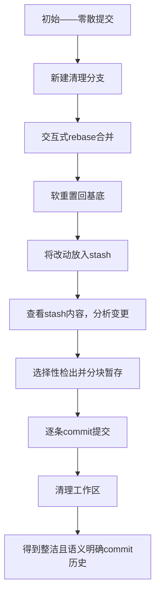

## 概述

在协作开发中，维护整洁且逻辑清晰的commit历史是一项核心技能。开发过程中产生的零散、小范围的提交往往杂乱无章，影响代码审查和回溯。本文介绍一种高效利用Git强大功能，对历史提交进行合并、拆分和优化的流程。

核心思路是利用**新建分支**、**交互式rebase**、**软重置**以及**stash管理**，再结合选择性暂存和分步commit，最终获得语义统一、便于理解的提交记录。

---

## 主要步骤及命令概览

| 命令                             | 作用                                                         |
|---------------------------------|--------------------------------------------------------------|
| `git checkout -b <new_branch>`  | 新建分支，专门处理整理工作，保留原分支不动                   |
| `git rebase -i <working_base>`  | 交互式rebase，合并零散commit为一个整体                       |
| `git reset --soft HEAD~1`        | 回退到基底commit状态，保留改动并放入索引区                  |
| `git stash save "stash message"` | 将合并后的改动存入stash，便于后续精细拆分提交               |

这样，我们将复杂的提交合成一个commit并缓存，为后续分步提交做准备。

---

## 分析及拆分改动

通过查看stash的diff，确定改动内容和目的：

```bash
$ git diff stash
```

**示例情况：**

| 文件 | 目的                                   |
|-------|--------------------------------------|
| a     | 目的I                               |
| b     | 目的II                              |
| c     | 目的II, 目的III                     |
| d     | 目的II, 目的IV                      |
| e     | 目的III                            |

可以根据不同目的将提交拆分成：

| 提交   | 目的     | 涉及文件及内容                         |
|---------|----------|------------------------------------|
| commit1 | 目的I    | 文件a                              |
| commit2 | 目的II   | 文件b，文件c和d的部分内容              |
| commit3 | 目的III  | 文件c剩余部分，文件e                  |
| commit4 | 目的IV   | 文件d剩余部分                        |

---

## 逐个提交的具体操作

### commit 1

| 命令                          | 说明                                   |
|-----------------------------|--------------------------------------|
| `git checkout stash -- a`    | 从stash中提取文件a，改动已暂存，可直接提交 |
| `git commit -s`              | 完成commit 1（含签署）                 |

### commit 2

| 命令                          | 说明                                                               |
|-----------------------------|------------------------------------------------------------------|
| `git checkout stash .`       | 将stash中所有文件检出（注意不能用`stash pop`避免stash消失）           |
| `git reset HEAD`             | 从暂存区移除所有改动，但保持在工作区                                   |
| `git add b`                  | 添加文件b的所有改动                                                  |
| `git add -p c`               | 交互式方式，选择文件c部分改动进行暂存                                |
| `git add -p d`               | 同上，选择文件d部分改动                                              |
| `git commit -s`              | 完成commit 2                                                       |
| `git clean -dfx`             | 清除未跟踪文件和空目录，恢复目录整洁（谨慎使用，确保无未保存内容）       |

#### git add -p 使用说明

交互式分块暂存每组改动，常用命令：

```
  Stage this hunk [y,n,e,?]? 
  y - 暂存当前块
  n - 跳过不暂存
  e - 编辑块，自行拆分片段
```

编辑模式中用“+”行增加，“-”行删除，“ ”行保持原状。适合对大块改动拆分成更精细的部分。

### 后续commit

流程同commit 2，依次检出、重置、分块暂存、提交、清理工作区。

---

## 常见错误及救援措施

| 场景                      | 应对方法                                                                                  |
|-------------------------|--------------------------------------------------------------------------------------------|
| 创建commit后需增删改动       | 使用`git rebase -i <target>~1`，选"edit"修改，调整后提交`git rebase --continue`              |
| 需要拆分某个已提交commit   | 同上，用`git reset --mixed HEAD~1`恢复变更到工作区，拆分后分别提交，再继续rebase               |
| rebase过程中发生冲突        | 手动解决冲突，使用`git add <file>`标记，`git rebase --continue`继续                        |
| 查看某文件的提交历史及改动    | 使用`git log <file>`, `git log -p <file>`, 或`git diff`限制文件范围                         |

---

## 流程示意图



通过本方法实现在保持代码逻辑一致的前提下，优化commit的结构，提升项目管理和代码审查效率。
