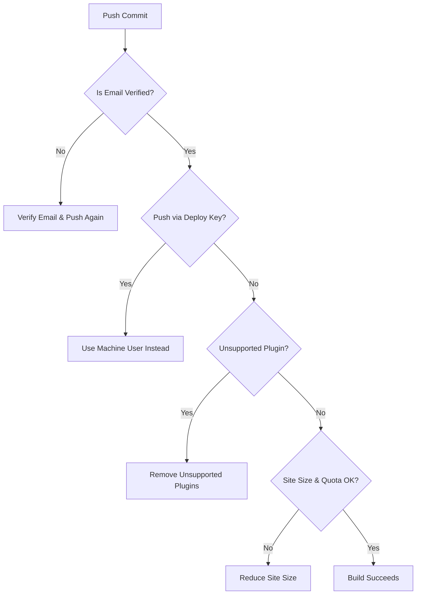

## Overview
GitHub Pages sites sometimes fail to build on GitHub's servers, triggering a failure notification email. Many failure notices pinpoint problematic files and errors, but some generic failures lack detailed diagnostic information. This guide provides a structured approach to troubleshooting your GitHub Pages build issues.

---

## Common Causes of Build Failures

| Issue                      | Description & Solution                                                                                   |
|----------------------------|---------------------------------------------------------------------------------------------------------|
| **Unverified Email Address**  | Builds only trigger when commits come from users with verified email addresses. Verify your email, then push again. Alternatively, contact GitHub Support to trigger a manual build. |
| **Deploy Key Pushes**         | Pushing with a deploy key cannot trigger builds on organization Pages repositories. Use a machine user with verified email as an organization member instead. |
| **Unsupported Plugins**       | GitHub Pages supports only a subset of Jekyll plugins. Using unsupported plugins causes builds to fail. Reference [Using Jekyll Plugins with GitHub Pages](https://help.github.com/articles/using-jekyll-plugins-with-github-pages/) for approved plugins and usage. |
| **Repository Size Limits**    | Both repositories and Pages sites have a soft size limit of 1 GB. Exceeding this may prevent builds. Reduce site size accordingly before retrying. |


## Source Configuration Overrides
Our build server enforces its own `source` setting during site generation, overriding any changes you make to the `source` option in `_config.yml`. Customizing `source` in your config file may cause your site to fail building.


## Integrating with Continuous Integration (CI) Services
Some CI tools, such as Travis CI, do not run builds on the `gh-pages` branch by default. To automate site builds as part of your CI pipeline, ensure your CI configuration explicitly includes `gh-pages`. For example, add this snippet to your `.travis.yml`:

```yaml
branches:
  only:
    - gh-pages
```

This ensures your CI system processes pushes to the `gh-pages` branch, keeping your GitHub Pages site in sync.

---

## Troubleshooting Workflow Diagram



---

This structured approach should help you diagnose and fix most GitHub Pages build issues efficiently.
