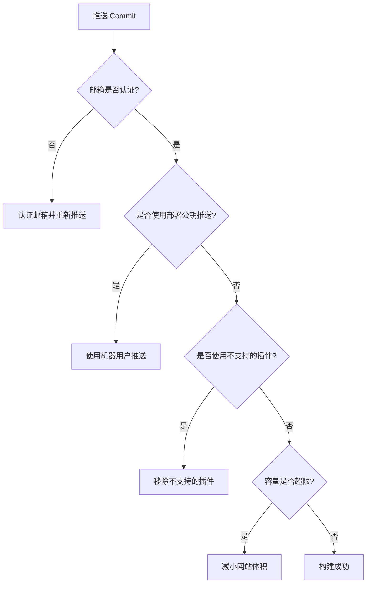

## 概述
GitHub Pages网站有时会在GitHub服务器上部署失败，并收到失败通知邮件。大部分失败邮件会明确指出出错文件及错误信息，但部分通用错误缺少详细诊断信息。本文为你梳理了排查GitHub Pages部署故障的系统方法。

---

## 常见故障原因

| 问题                      | 描述与解决方案                                                                                           |
|---------------------------|---------------------------------------------------------------------------------------------------------|
| **邮箱未认证**              | 只有经过邮箱认证的用户推送commit才会触发构建。请验证邮箱后重新推送，或联系GitHub支持手动触发构建。             |
| **使用部署公钥推送**        | 对组织的Pages仓库使用部署公钥推送不会触发构建。建议使用具备邮箱认证的机器用户（Machine User）加入组织进行推送。|
| **不支持的插件**            | GitHub Pages仅支持部分Jekyll插件，使用不支持的插件导致构建失败。请参考[Github文档](https://help.github.com/articles/using-jekyll-plugins-with-github-pages/)选择支持插件。  |
| **容量限制**                | 仓库和Pages网站均有1GB软性容量限制。超过限制可能导致无法部署，请裁减网站内容后重新尝试。                      |


## 源目录配置覆盖
我们的构建服务器会覆盖你在 `_config.yml` 文件中配置的 `source` 目录，因此修改该配置可能导致无法正常部署。


## 持续集成（CI）服务集成
部分CI服务如Travis CI，默认不会构建 `gh-pages` 分支。若希望CI自动构建该分支，需在配置文件中显式声明，例如在 `.travis.yml` 中添加：

```yaml
branches:
  only:
    - gh-pages
```

这样可确保CI监听并构建 `gh-pages` 分支，保持GitHub Pages网站的自动更新。

---

## 故障排查流程图



---

通过这个清晰的流程指导，可以有效定位并解决GitHub Pages的构建问题，提升部署成功率。
