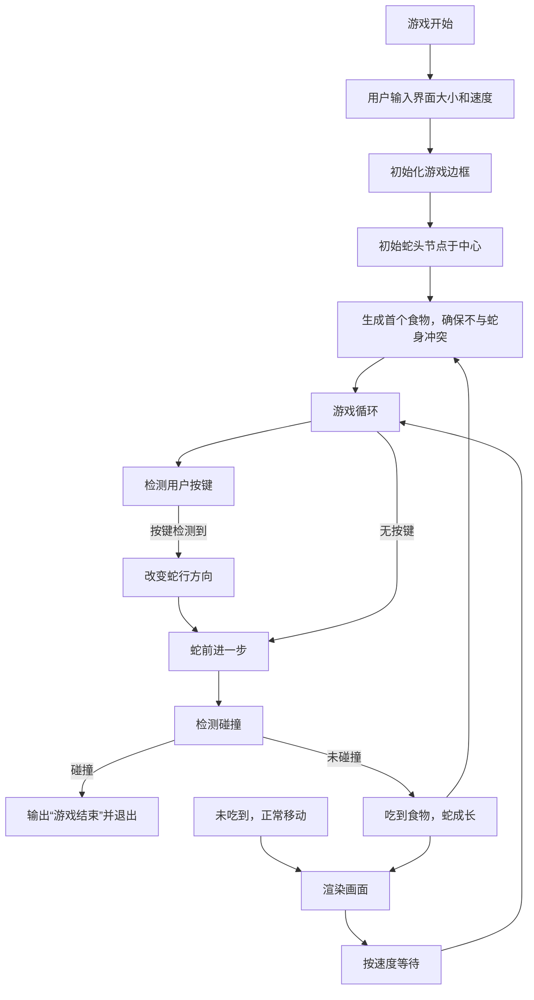

## 概述

本文基于经典项目[C++贪吃蛇](http://www.cnblogs.com/gq-ouyang/archive/2012/12/09/2810218.html#2858914)的实现，修正了两个关键问题：

- **食物生成**：随机生成食物时保证不与蛇身节点重合。
- **碰撞检测**：除了检测边界碰撞外，增加了蛇头与自身身体碰撞的判定。

实现采用面向对象设计，模块化包括游戏边框的渲染、蛇身体的链表管理、以及移动方向和游戏逻辑控制。

---

## 核心模块

| 模块           | 职责描述                                  |
|----------------|------------------------------------------|
| `Frame`        | 维护与渲染游戏窗口及边界
| `snakeNode`    | 蛇的节点，双向链表实现蛇身
| `movement`     | 管理蛇的移动、用户输入、食物生成及碰撞逻辑

---

## 主要流程示意



---

## 代码亮点

### 游戏边框初始化与显示

使用二维字符数组实现窗口，用`#`绘制边界。

```cpp
void Frame::initializeFrame() {
    if (width <= 0 || height <= 0) {
        cerr << "错误的框架尺寸！" << endl;
        exit(EXIT_FAILURE);
    }

    // 初始化窗口为全空格
    window.assign(height, vector<char>(width, ' '));

    // 绘制竖边界
    for (int i = 0; i < height; ++i) {
        window[i][0] = window[i][width - 1] = '#';
    }
    // 绘制横边界
    for (int j = 0; j < width; ++j) {
        window[0][j] = window[height - 1][j] = '#';
    }
}
```

### 蛇节点管理

蛇身以双向链表方式存储。移动时头部增加新节点，若未吃到食物则删除尾部。

```cpp
void snakeNode::addHead(int x, int y) {
    snakeNode* newNode = new snakeNode(x, y);
    newNode->next = head;
    if (head) head->prior = newNode;
    else tail = newNode;
    head = newNode;
    frame.window[x][y] = '~'; // 绘制蛇身
}

void snakeNode::delTail() {
    if (!tail) return;
    frame.window[tail->x][tail->y] = ' ';
    snakeNode* oldTail = tail;
    tail = tail->prior;
    if (tail) tail->next = nullptr;
    else head = nullptr;
    delete oldTail;
}
```

### 移动及游戏逻辑

包含方向管理及用户输入处理，食物随机放置时避免占用蛇节点。

```cpp
void movement::randomFood() {
    srand((unsigned)time(NULL));
    do {
        fx = rand() % (frame.height - 2) + 1;
        fy = rand() % (frame.width - 2) + 1;
    } while (block(fx, fy)); // 保证食物不在蛇身上

    frame.window[fx][fy] = 'x';
}

void movement::move() {
    int h = head->x, w = head->y;
    switch(dir) {
        case UP: --h; break;
        case DOWN: ++h; break;
        case LEFT: --w; break;
        case RIGHT: ++w; break;
    }

    if (outOfFrame(h, w) || block(h, w)) {
        cout << "游戏结束！" << endl;
        exit(EXIT_FAILURE);
    }

    if (h == fx && w == fy) {
        head->addHead(fx, fy); // 蛇身增长
        randomFood();          // 重新生成食物
    } else {
        head->addHead(h, w);   // 正常前进
        tail->delTail();       // 删除尾部
    }
}
```

### 用户输入处理

通过WASD控制方向，禁止蛇倒退。

```cpp
void movement::changeDirection(char key) {
    switch (key) {
        case 'w': if (dir != DOWN) dir = UP; break;
        case 's': if (dir != UP) dir = DOWN; break;
        case 'a': if (dir != RIGHT) dir = LEFT; break;
        case 'd': if (dir != LEFT) dir = RIGHT; break;
    }
}
```

---

## 使用说明

请在支持`conio.h`和`windows.h`的Windows控制台环境中编译运行。本程序要求输入界面尺寸和速度，运行后即开始游戏，控制蛇的运动以吃到食物并避免碰撞边界及自身。

---

此项目不仅演示了贪吃蛇游戏的基本构建，也体现了对游戏逻辑中关键细节的严密控制，是学习C++游戏编程的优秀案例。

---


---
