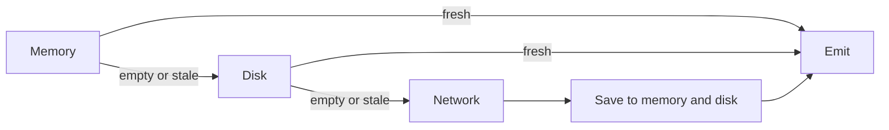

This is one of the simplest reactive patterns for building a <u>fast, cache-aware data pipeline</u> in Android.

## The problem

A single piece of app data often has three possible sources:

- **Memory**: fastest, but process-bound
- **Disk**: slower, but survives restarts
- **Network**: freshest, but most expensive

You usually want both of these properties:

1. **Return data as quickly as possible**
2. **Refresh from the network when cached data becomes stale**

RxJava models this well because each source can be represented as an `Observable<Data>` and composed into a single stream.

## Core pattern: `concat()` + `first()`

If each source either emits one `Data` item or completes empty, then the fallback chain is straightforward:

```java
Observable<Data> memory = memorySource();
Observable<Data> disk = diskSource();
Observable<Data> network = networkSource();

Observable<Data> data = Observable
    .concat(memory, disk, network)
    .first();
```

### Why this works

`concat()` subscribes to its children **sequentially**. That means:

- If **memory** emits data, the stream ends there
- If memory completes empty, RxJava moves to **disk**
- If disk is also empty, it finally hits the **network**

This is the key detail: **slower sources are never queried unless earlier sources fail to produce a value**.

| Source | Typical cost | Why check first? |
|---|---:|---|
| Memory | Lowest | Instant access |
| Disk | Medium | Persistent cache |
| Network | Highest | Fresh data |

## Handling stale cache entries

A naive cache chain can become *too effective*: it keeps serving old data forever.

The fix is to make `first()` selective. Only accept data that is still valid:

```java
Observable<Data> memory = memorySource();
Observable<Data> disk = diskSource();
Observable<Data> network = networkSource()
    .doOnNext(data -> {
        saveToMemory(data);
        saveToDisk(data);
    });

Observable<Data> data = Observable
    .concat(memory, disk, network)
    .first(Data::isUpToDate);
```

Now the behavior is much better:

- Memory emits stale data? Skip it.
- Disk emits fresh data? Use it.
- Both caches are stale or empty? Fetch from network, then save the result.



## `first()` vs `takeFirst()`

In older RxJava APIs, both operators can express this pattern, but they differ when **no valid item exists**.

| Operator | If no source emits acceptable data | Best when |
|---|---|---|
| `first()` | Throws `NoSuchElementException` | Missing data is an error |
| `takeFirst()` | Completes without error | Missing data is acceptable |

That choice is architectural, not stylistic.

- Use **`first()`** when downstream code expects data and should fail loudly if nothing is available.
- Use **`takeFirst()`** when “no data” is a normal outcome.

> In newer RxJava versions, the same idea is usually expressed with combinations like `filter(...).firstElement()` or `firstOrError()`. The pattern stays the same even if the exact operator names shift.

## Takeaway

This approach works because it treats caching as a **priority-ordered stream**, not a pile of `if/else` branches. By composing **memory → disk → network** with `concat()` and stopping at the first valid value, you get a loader that is:

- **fast by default**
- **network-efficient**
- **explicit about freshness**
- **easy to extend and test**

For layered data access, this is still one of the cleanest ideas in RxJava.
