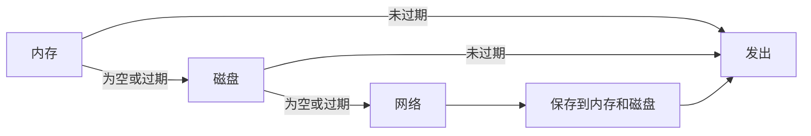

这是在 Android 中构建**快速且具备缓存感知能力的数据管道**时，最简单的响应式模式之一。

## 问题

应用中的同一份数据，通常有三个可能的来源：

- **内存**：最快，但受限于进程生命周期
- **磁盘**：更慢，但重启后仍然存在
- **网络**：最新，但代价最高

通常你会希望同时具备这两个特性：

1. **尽可能快地返回数据**
2. **当缓存数据过期时，从网络刷新**

RxJava 很适合表达这种场景，因为每个数据源都可以表示为一个 `Observable<Data>`，再组合成一条统一的数据流。

## 核心模式：`concat()` + `first()`

如果每个数据源要么发出一个 `Data` 项，要么空完成，那么这条回退链就非常直接：

```java
Observable<Data> memory = memorySource();
Observable<Data> disk = diskSource();
Observable<Data> network = networkSource();

Observable<Data> data = Observable
    .concat(memory, disk, network)
    .first();
```

### 为什么这样可行

`concat()` 会按**顺序**订阅其子流。这意味着：

- 如果 **memory** 发出了数据，流就在这里结束
- 如果 memory 空完成，RxJava 就会转到 **disk**
- 如果 disk 也为空，最后才会访问 **network**

关键点就在这里：**只有当前面的数据源无法产出值时，才会查询更慢的数据源**。

| 数据源 | 典型成本 | 为什么优先检查？ |
|---|---:|---|
| 内存 | 最低 | 即时访问 |
| 磁盘 | 中等 | 持久化缓存 |
| 网络 | 最高 | 最新数据 |

## 处理过期缓存项

一个天真的缓存链可能会变得*过于有效*：它会永远持续提供旧数据。

解决办法是让 `first()` 变得有选择性：只接受仍然有效的数据：

```java
Observable<Data> memory = memorySource();
Observable<Data> disk = diskSource();
Observable<Data> network = networkSource()
    .doOnNext(data -> {
        saveToMemory(data);
        saveToDisk(data);
    });

Observable<Data> data = Observable
    .concat(memory, disk, network)
    .first(Data::isUpToDate);
```

现在，这个行为就合理得多：

- Memory 发出过期数据？跳过。
- Disk 发出未过期的数据？使用它。
- 两级缓存都已过期或为空？从网络获取，然后保存结果。



## `first()` 与 `takeFirst()`

在较早版本的 RxJava API 中，这两个操作符都能表达这种模式，但当**不存在有效项**时，它们的行为不同。

| 操作符 | 如果没有任何数据源发出可接受的数据 | 最适合的场景 |
|---|---|---|
| `first()` | 抛出 `NoSuchElementException` | 缺失数据属于错误 |
| `takeFirst()` | 无错误地完成 | “没有数据”是可接受结果 |

这个选择关乎架构，而不是风格。

- 当下游代码预期一定有数据，且在没有数据时应该明确失败，就用 **`first()`**。
- 当“没有数据”本身就是一种正常结果时，就用 **`takeFirst()`**。

> 在较新的 RxJava 版本中，同样的思想通常会用 `filter(...).firstElement()` 或 `firstOrError()` 之类的组合来表达。即使具体的操作符名称变化了，这个模式本身并没有变。

## 结论

这种方法之所以有效，是因为它把缓存看作一条**按优先级排序的数据流**，而不是一堆 `if/else` 分支。通过用 `concat()` 组合 **memory → disk → network**，并在遇到第一个有效值时停止，你会得到一个具备以下特性的加载器：

- **默认就快**
- **节省网络**
- **显式处理数据新鲜度**
- **易于扩展和测试**

对于分层数据访问来说，这仍然是 RxJava 中最简洁、最清晰的思路之一。
