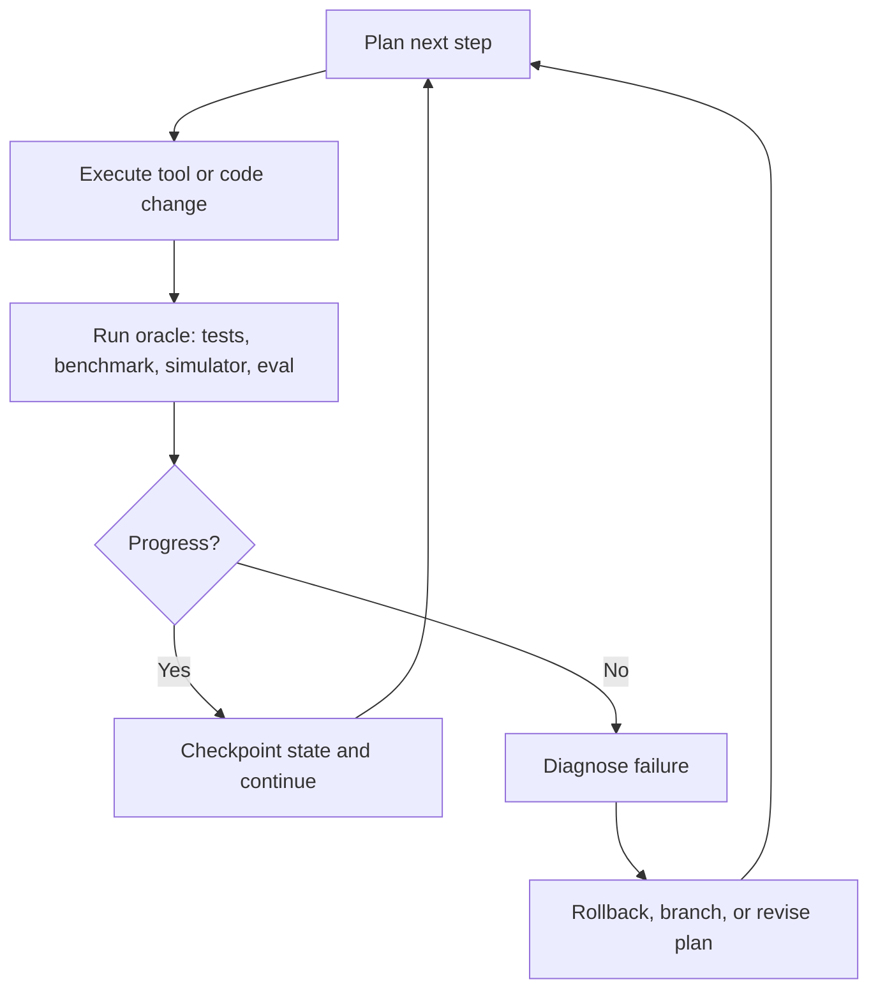

## Duration is the least interesting metric

Anthropic's March 23, 2026 research note on long-running Claude is easy to summarize as "agents can now work for a long time." That is true, but it is the least interesting part.

Time alone does not create autonomy. A broken agent can also run for twelve hours. The real question is whether a long-running system can keep making **corrective progress** instead of accumulating elegant failure.

That is why the report matters. It highlights a deeper idea: long-horizon agent work only becomes credible when the environment supplies an **oracle**, a **memory**, and a **recovery loop**.

## The three missing pieces

| Missing piece | What breaks without it | What a good system does instead |
|---|---|---|
| Oracle | The agent cannot tell whether it is getting warmer or colder | Gives objective feedback from tests, simulators, benchmarks, or evaluators |
| Memory | The agent relearns the same lesson every few hours | Preserves decisions, failures, checkpoints, and open hypotheses |
| Recovery loop | One bad branch ruins the whole run | Lets the system roll back, retry, branch, and continue |

This framing is far more useful than asking whether a model can "think longer."

## Why scientific and engineering work are special

Long-running agents look strongest in domains where the world answers back.

Scientific coding, numerical experiments, and real software tasks often have something many language tasks do not:

- executable artifacts,
- test suites,
- measurable outputs,
- and external checks that are harder to bluff.

That matters because long-horizon work is not mainly a reasoning problem. It is a **closed-loop control problem**.



If you remove the oracle, the loop turns into storytelling. If you remove the checkpoint, it turns into gambling.

## The operational design lesson

My strongest takeaway is that long-running agents are less like "super chatbots" and more like small distributed systems.

They need:

- persistent working memory;
- explicit scratchpads and run logs;
- resumable tasks;
- bounded tool permissions;
- and a stable notion of what counts as success.

A human operator would probably encode that discipline with artifacts like these:

```text
RUN_ID=chem-sim-042
GOAL=stabilize benchmark variance below 1.5%
ORACLE=pytest -q && python benchmark.py --trials 20
CHECKPOINT=save notes, git diff, metrics snapshot every major branch
STOP_IF=two failed branches with no metric improvement
```

This looks unromantic, but that is the point. Durable autonomy usually grows out of procedure, not mythology.

## What people still underestimate

Many teams still talk about agent progress as if the frontier is mostly in model intelligence. I think that is incomplete.

For long-running work, the harder question is often: **what kind of environment lets intelligence compound instead of drift?**

If the system cannot:

- measure whether it improved,
- remember why it changed course,
- and recover after a bad move,

then giving it more time just gives failure more room.

> Autonomy begins where recovery becomes normal, not exceptional.

## What I would build around this

If I were designing a serious long-running agent stack, I would prioritize infrastructure before personality:

1. **Verifiable progress signals** over vague self-reflection.
2. **Checkpointed state** over long hidden context.
3. **Recoverable branches** over single irreversible runs.
4. **Compact operator summaries** over raw transcript dumping.

The lesson is not that agents can now work all weekend.

The lesson is that long-running agency becomes real when the system can stay oriented in time: what it tried, what failed, what improved, and where to resume next. That is a systems design problem before it is a prompt design problem.

## References

- [Long-running Claude in autonomous scientific coding](https://www.anthropic.com/research/long-running-Claude)
