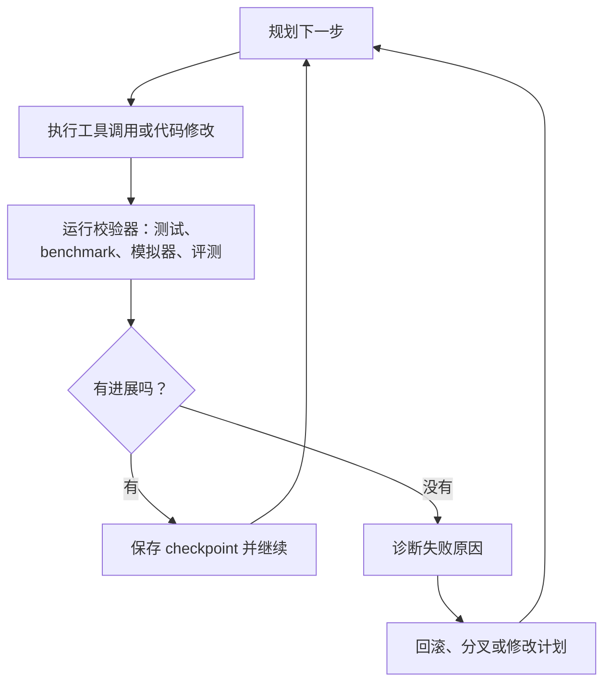

## “能跑很久”其实是最不重要的指标

Anthropic 在 2026 年 3 月 23 日发布的 long-running Claude 研究，很容易被总结成一句话：智能体现在可以连续工作很久。这当然是真的，但也是最不有意思的那部分。

时间本身不会自动产生自治。一个坏掉的智能体，同样可以错上十二个小时。真正的问题是：一个长时运行的系统，能不能持续产生 **可纠偏的进展**，而不是把失败越积越漂亮。

这也是这篇研究真正值得看的地方。它揭示了一个更底层的事实：长时间跨度上的 agent 工作，只有在环境同时提供 **客观判标（真值校验器）**、**记忆** 和 **恢复回路** 时，才会变得可信。

## 三个不能缺的部件

| 缺什么 | 没有它会怎样 | 一个靠谱系统应该怎么做 |
|---|---|---|
| 客观判标 | 智能体不知道自己是在变好还是在跑偏 | 用测试、模拟器、benchmark 或 evaluator 提供客观反馈 |
| 记忆 | 智能体每隔几小时就把同一个教训重新学一遍 | 保存决策、失败记录、checkpoint 和待验证假设 |
| 恢复回路 | 一次错误分支就把整个长任务拖垮 | 允许系统回滚、重试、分叉并继续推进 |

比起追问“模型能不能想更久”，这个框架对工程实践有用得多。

## 为什么科学计算和工程任务特别适合

长时运行智能体之所以在科学代码、数值实验和真实软件任务里显得更强，一个关键原因是：**世界会回嘴**。

这些领域通常拥有很多纯语言任务没有的东西：

- 可执行产物；
- 测试套件；
- 可量化输出；
- 更难蒙混过关的外部校验。

这很重要，因为长时间任务本质上并不只是推理问题，而是一个 **闭环控制问题**。



一旦把客观判标（真值校验器）拿掉，这个回路就会退化成讲故事；一旦把 checkpoint 拿掉，这个回路就会退化成赌博。

## 运营设计上的启发

我最大的体感是：长时运行智能体越来越不像“超级聊天机器人”，反而越来越像一个小型分布式系统。

它需要：

- 持久化的工作记忆；
- 明确的草稿区与运行日志；
- 可恢复的任务；
- 有边界的工具权限；
- 以及一套稳定的成功判定标准。

一个人类操作者，大概会把这套纪律编码成类似下面的东西：

```text
RUN_ID=chem-sim-042
GOAL=stabilize benchmark variance below 1.5%
ORACLE=pytest -q && python benchmark.py --trials 20
CHECKPOINT=save notes, git diff, metrics snapshot every major branch
STOP_IF=two failed branches with no metric improvement
```

它一点也不浪漫，但这恰恰说明问题。可靠的自治，通常不是从神话里长出来的，而是从流程里长出来的。

## 还有什么被低估了

现在很多团队谈 agent 进展，仍然像是在默认“主要瓶颈还是模型本身够不够聪明”。我觉得这不完整。

对于长时运行任务，更难的问题往往是：**什么样的环境，能让智能不断累积，而不是不断漂移？**

如果系统做不到：

- 判断自己是否真的改进了；
- 记住自己为什么中途改道；
- 在走错一步之后还能恢复，

那么给它更多时间，只是给失败更多空间。

> 真正的自治，不是从“能一直跑”开始，而是从“失败之后还能正常恢复”开始。

## 如果让我围绕这个方向搭系统

如果我要设计一套严肃的 long-running agent stack，我会优先建设基础设施，而不是人格幻觉：

1. **可验证进展信号**，优先于模糊自省。
2. **可 checkpoint 的状态**，优先于超长隐藏上下文。
3. **可恢复分支**，优先于单次不可逆长跑。
4. **压缩后的操作者摘要**，优先于原始长 transcript 倾倒。

所以，这篇研究真正让我在意的，不是“智能体现在周末也能一直工作”。

真正让我在意的是：只有当系统能在时间维度上保持方向感时，长时自治才成立。它必须知道自己做过什么、哪里失败了、什么真的提升了、下一次该从哪里继续。这首先是系统设计问题，其次才是提示词设计问题。

## 参考

- [Long-running Claude in autonomous scientific coding](https://www.anthropic.com/research/long-running-Claude)
