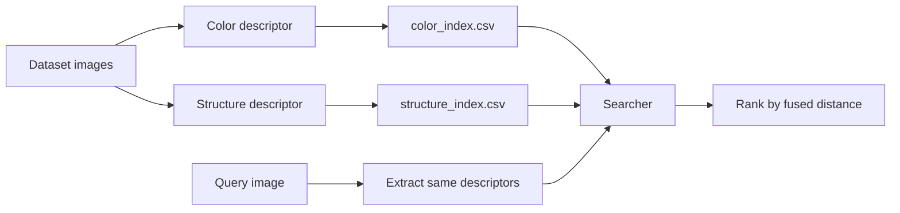

## Why this project

OpenCV is still a strong foundation for practical computer vision work: it is fast, portable, and optimized for real-time tasks. This project uses **OpenCV + Python** to build a small **content-based image retrieval** system for a personal image library. The goal is not web-scale search, but a clean end-to-end pipeline: **extract features, build indexes, compare descriptors, return the top matches**.

Industrial systems may use SIFT, perceptual hashes, or deep embeddings. Here, the design stays intentionally classical and interpretable by combining **color** and **composition** cues.

> **Important:** `cv2.imread()` loads images in **BGR**, not RGB. Convert to **HSV** before computing color descriptors.



## System design

The engine uses two handcrafted descriptors:

| Component | Purpose | Key idea |
|---|---|---|
| `ColorDescriptor` | Capture color distribution | HSV histogram over 4 corners + 1 elliptical center |
| `StructureDescriptor` | Capture coarse layout | Resize to a fixed grid such as `16x16` |
| `Searcher` | Rank similar images | Fuse color and structure distances |

### 1) Color descriptor

The image is converted from BGR to HSV, then split into **five regions**: top-left, top-right, bottom-left, bottom-right, and a central **ellipse**. For each region, a normalized 3D histogram is computed with bins such as `(8, 12, 3)` for **Hue, Saturation, Value**.

The center region is given a larger weight, for example `5.0`, because many photos place the main subject near the middle. The final feature vector is the concatenation of those five histograms.

```python
class ColorDescriptor:
    __slots__ = ("bins", "center_weight")

    def __init__(self, bins=(8, 12, 3), center_weight=5.0):
        self.bins = bins
        self.center_weight = center_weight

    def histogram(self, hsv, mask, weighted=False):
        hist = cv2.calcHist([hsv], [0, 1, 2], mask, self.bins,
                            [0, 180, 0, 256, 0, 256])
        hist = cv2.normalize(hist, None).flatten()
        return hist * self.center_weight if weighted else hist
```

### 2) Structure descriptor

The original implementation resized each image to a fixed dimension and used the resulting matrix as a coarse structural signature. That idea is still valid, but it should be made explicit: resize, convert if needed, cast to float, then flatten.

```python
def structure_vector(image, size=(16, 16)):
    small = cv2.resize(image, size, interpolation=cv2.INTER_AREA)
    hsv = cv2.cvtColor(small, cv2.COLOR_BGR2HSV)
    return hsv.astype("float32").flatten() / 255.0
```

This descriptor is simple, but useful for capturing rough composition and dominant spatial arrangement.

## Indexing and retrieval

Each dataset image is processed once and written to CSV-based indexes. For small libraries, CSV is enough and keeps the pipeline transparent.

- **Color distance:** use the **chi-squared distance** on histogram vectors.
- **Structure distance:** use a normalized **L2 distance** on the resized layout vector.
- **Fusion:** combine both scores with tunable weights.

```python
def chi2_distance(a, b, eps=1e-10):
    return 0.5 * np.sum(((a - b) ** 2) / (a + b + eps))

score = alpha * color_distance + beta * structure_distance
```

**Lower scores mean better matches.** In practice, the two distances should be normalized or weighted so one descriptor does not dominate the other.

## Modernized implementation notes

The legacy code had a few issues worth fixing:

- `__slot__` should be `__slots__`
- `xrange` should be `range` in Python 3
- `colorDesriptor` should be `colorDescriptor`
- use `csv.reader` instead of regex to parse CSV rows
- flatten structure features before comparison
- prefer `with open(...)` for file handling

Example commands:

```bash
python index.py --dataset dataset --color-index color_index.csv --structure-index structure_index.csv
python search.py --color-index color_index.csv --structure-index structure_index.csv --results dataset --query query/pyramid.jpg
```

## What this project demonstrates

This is a strong **portfolio-scale retrieval system** because it exposes the full loop: feature engineering, indexing, similarity search, and result ranking. It is lightweight, explainable, and easy to extend. If you later need more robustness against cropping, rotation, or semantic similarity, the next step is to replace handcrafted descriptors with **local features** or **deep embeddings**, while keeping the same search pipeline.
