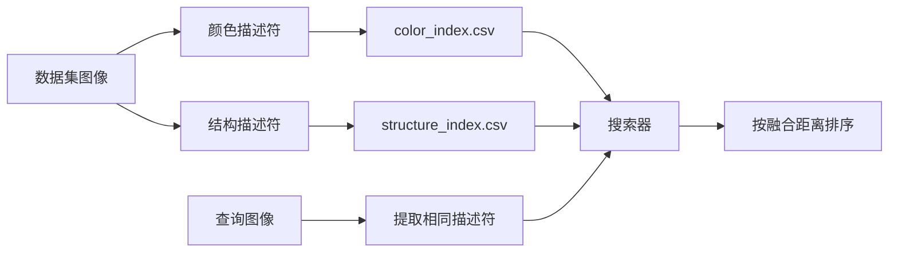

## 为什么做这个项目

OpenCV 依然是实用型计算机视觉工作的坚实基础：它速度快、可移植，并且针对实时任务做了优化。这个项目使用 **OpenCV + Python** 为个人图片库构建一个小型的 **基于内容的图像检索** 系统。目标不是做 Web 级搜索，而是搭建一条清晰的端到端流水线：**提取特征、构建索引、比较描述符、返回最匹配的结果**。

工业级系统可能会使用 SIFT、感知哈希或深度嵌入。这里的设计则刻意保持经典且可解释，通过结合 **颜色** 与 **构图** 两类线索来实现。

> **重要：** `cv2.imread()` 读取图像时使用的是 **BGR**，不是 RGB。在计算颜色描述符之前，先转换到 **HSV**。



## 系统设计

该引擎使用两个手工设计的描述符：

| 组件 | 用途 | 核心思路 |
|---|---|---|
| `ColorDescriptor` | 捕获颜色分布 | 在 4 个角 + 1 个椭圆中心区域上计算 HSV 直方图 |
| `StructureDescriptor` | 捕获粗粒度布局 | 缩放到固定网格，如 `16x16` |
| `Searcher` | 对相似图像排序 | 融合颜色与结构距离 |

### 1) 颜色描述符

图像先从 BGR 转换为 HSV，然后被划分为 **五个区域**：左上、右上、左下、右下，以及中央的 **椭圆区域**。对每个区域，都会计算一个归一化的 3D 直方图，桶数可以设为 `(8, 12, 3)`，分别对应 **色相、饱和度、明度**。

中央区域会给予更大的权重，例如 `5.0`，因为很多照片会把主体放在画面中间附近。最终的特征向量就是这五个直方图的拼接结果。

```python
class ColorDescriptor:
    __slots__ = ("bins", "center_weight")

    def __init__(self, bins=(8, 12, 3), center_weight=5.0):
        self.bins = bins
        self.center_weight = center_weight

    def histogram(self, hsv, mask, weighted=False):
        hist = cv2.calcHist([hsv], [0, 1, 2], mask, self.bins,
                            [0, 180, 0, 256, 0, 256])
        hist = cv2.normalize(hist, None).flatten()
        return hist * self.center_weight if weighted else hist
```

### 2) 结构描述符

最初的实现会把每张图像缩放到固定尺寸，并将得到的矩阵当作粗粒度的结构签名。这个思路依然有效，但应该写得更明确：先缩放，必要时做颜色空间转换，再转成 float，最后展平。

```python
def structure_vector(image, size=(16, 16)):
    small = cv2.resize(image, size, interpolation=cv2.INTER_AREA)
    hsv = cv2.cvtColor(small, cv2.COLOR_BGR2HSV)
    return hsv.astype("float32").flatten() / 255.0
```

这个描述符很简单，但对于捕捉大致构图和主导性的空间布局很有帮助。

## 索引与检索

数据集中的每张图像只处理一次，并写入基于 CSV 的索引。对于小型图片库，CSV 已经足够，同时也让整条流水线保持透明。

- **颜色距离：** 在直方图向量上使用 **卡方距离**。
- **结构距离：** 在缩放后的布局向量上使用归一化的 **L2 距离**。
- **融合：** 用可调权重组合两种分数。

```python
def chi2_distance(a, b, eps=1e-10):
    return 0.5 * np.sum(((a - b) ** 2) / (a + b + eps))

score = alpha * color_distance + beta * structure_distance
```

**分数越低，匹配越好。** 在实际使用中，应当对这两种距离做归一化或加权，避免某一个描述符完全主导最终结果。

## 现代化实现说明

旧代码里有几个值得修复的问题：

- `__slot__` 应为 `__slots__`
- 在 Python 3 中，`xrange` 应改为 `range`
- `colorDesriptor` 应改为 `colorDescriptor`
- 解析 CSV 行时，使用 `csv.reader`，不要用正则表达式
- 比较之前先将结构特征展平
- 文件处理优先使用 `with open(...)`

示例命令：

```bash
python index.py --dataset dataset --color-index color_index.csv --structure-index structure_index.csv
python search.py --color-index color_index.csv --structure-index structure_index.csv --results dataset --query query/pyramid.jpg
```

## 这个项目展示了什么

这是一个很适合作为 **作品集展示** 的检索系统，因为它完整呈现了整个闭环：特征工程、索引构建、相似度搜索，以及结果排序。它轻量、可解释，而且易于扩展。如果你之后需要更强的抗裁剪、抗旋转能力，或者更好的语义相似性，下一步就是用 **局部特征** 或 **深度嵌入** 替换手工描述符，同时保留同一套搜索流水线。
