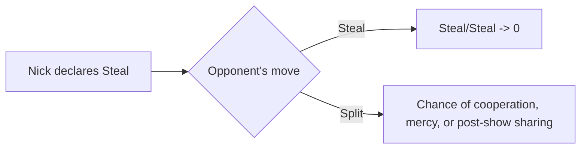

## Golden Balls as a TV-friendly Prisoner’s Dilemma

*Golden Balls* turns a classic game theory problem into television. In the final round, two contestants independently choose **Split** or **Steal**. The incentives are simple: mutual cooperation shares the pot, unilateral betrayal captures everything, and mutual betrayal destroys the prize.

| Your choice | Opponent splits | Opponent steals |
| --- | --- | --- |
| **Split** | You get 50% | You get 0% |
| **Steal** | You get 100% | You get 0% |

In the standard one-shot analysis, **Steal** weakly dominates **Split**: whatever the other player does, stealing is at least as good for you. That is why ordinary pre-game promises so often collapse.

## Why promising Split backfires

Most contestants try the obvious script: *Let’s both split. I promise I will.* The problem is that this is **cheap talk**. If the other player believes you, their decision becomes easier in the worst possible way:

- If they also split, they receive **50%**.
- If they steal while you split, they receive **100%**.

By reassuring them that you will cooperate, you remove the fear of mutual destruction and spotlight their best temptation. In system terms, you are not changing the game’s structure—you are volunteering to be exploited inside it.

## Nick’s inversion: announce Steal

One contestant, Nick, flipped the script. He effectively said:

> I am going to choose **Steal**. You should choose **Split**, and I promise I will share the money with you after the show.

Formally, this is not a binding contract. There is no legal enforcement, and in strict game-theoretic terms it is not a true commitment device. But as a negotiation move, it is brilliant because it changes the opponent’s **perceived** payoffs.

If the opponent chooses **Steal**, they risk locking in a zero-zero outcome. If they choose **Split**, they preserve some upside: Nick might honor his promise later—or simply relent and choose **Split** on stage. Under those beliefs, **Split** becomes the safer response, or at least the only response with positive expected value.

That is exactly what made the episode memorable. After all the tension, both contestants revealed **Split**, and each walked away with half. Nick did not solve the Prisoner’s Dilemma in the formal equilibrium sense; he sidestepped it by reshaping beliefs long enough to steer the other player toward cooperation.

## What this episode actually teaches

The lesson is not *always threaten to steal*. It is more precise:

1. **Promises of cooperation can strengthen the incentive to defect.**
2. **Precommitment—real or convincingly performed—can alter behavior even in one-shot settings.**
3. **This works only under narrow conditions:** open negotiation, possible side payments, and enough trust or social pressure for the threat to feel real.

In repeated games, this tactic is far weaker. A player who manipulates others today may burn the credibility they need tomorrow. But in a one-off interaction like a TV finale, Nick’s move was a sharp piece of strategic framing: do not just ask for cooperation—change what the other side thinks their best response is.
