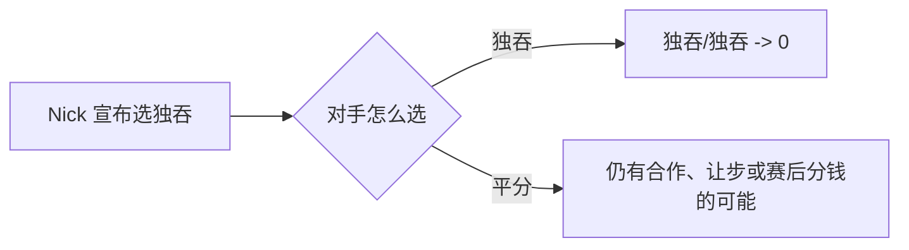

## *Golden Balls*：适合电视呈现的囚徒困境

*Golden Balls* 把一个经典的博弈论问题搬上了电视。在最后一轮，两名选手各自独立选择 **平分** 或 **独吞**。激励结构很简单：双方合作就平分奖池，一方背叛就独得全部，双方都背叛则奖金作废。

| 你的选择 | 对手平分 | 对手独吞 |
| --- | --- | --- |
| **平分** | 你拿 50% | 你拿 0% |
| **独吞** | 你拿 100% | 你拿 0% |

在标准的一次性博弈分析中，**独吞**对**平分**构成弱支配：无论对方怎么选，独吞对你来说都至少不更差。这就是为什么普通的赛前承诺往往会崩塌。

## 为什么承诺平分会适得其反

大多数选手都会照着最显而易见的台词走：*我们都选平分吧，我保证我会。* 问题在于，这只是**廉价空谈**。如果对方真的信了你，他们的决策反而会以最糟糕的方式变得更简单：

- 如果他们也选平分，他们拿 **50%**。
- 如果你选平分而他们选独吞，他们拿 **100%**。

当你反复向对方保证自己会合作时，你消除了双方同归于尽的恐惧，同时把他们最有诱惑力的选项照得一清二楚。换成系统视角看，你并没有改变博弈结构——你只是在主动把自己送进一个更容易被利用的位置。

## Nick 的反转：宣布独吞

有一位选手 Nick 把剧本彻底反了过来。他等于是在说：

> 我会选 **独吞**。你应该选 **平分**，我保证节目结束后会把钱分给你。

从形式上说，这不是一份具有约束力的合同。它没有法律执行力，严格按博弈论来讲，也不是真正的承诺机制。但作为一种谈判动作，它非常高明，因为它改变了对手**主观感知中的**收益。

如果对手选择 **独吞**，他们就有可能把结果锁死在双方都是零的局面。可如果他们选择 **平分**，就还保留着上行空间：Nick 之后也许会兑现承诺——或者干脆在台上改选 **平分**。在这种信念下，**平分**就成了更安全的回应，至少也是唯一一个仍有正向期望值的回应。

这正是那一集令人难忘的原因。经历了所有拉扯和紧张之后，两名选手最终亮出的都是 **平分**，于是各自带走了一半奖金。Nick 并没有在严格的均衡意义上“解决”囚徒困境；他只是通过重塑信念，绕开了它，而且绕开的时间恰好足够把对方引向合作。

## 这一集真正说明了什么

这件事的教训并不是 *永远都要威胁独吞*。更准确地说，是：

1. **合作承诺反而可能强化背叛的激励。**
2. **预先承诺——无论是真实的，还是足够逼真的表演——即使在一次性博弈中也能改变行为。**
3. **这只在非常狭窄的条件下有效：** 可以公开谈判，允许某种形式的事后补偿，并且存在足够的信任或社会压力，让这种威胁显得可信。

在重复博弈里，这一招要弱得多。今天操纵别人的人，明天很可能就耗尽了自己最需要的可信度。但在电视决赛这种一次性交互中，Nick 的操作是一记非常锋利的策略性框定：不要只去请求合作——要改变对方对“自己最佳回应是什么”的判断。
