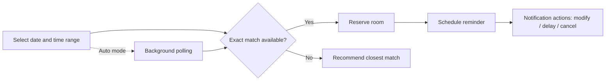

# Tutu-Android

> A campus Android utility that turned a midnight reservation scramble into a manageable mobile workflow.

At Tsinghua University, booking a study room in the Humanities Library was a small but recurring systems problem. Rooms opened on schedule, availability changed fast, and missing a reservation window could lead to a violation record and a temporary booking ban. **Tutu-Android** was built as a focused assistant for that exact scenario.

Instead of acting as a thin mobile wrapper around the web portal, the app modeled reservation as a **time-critical workflow**: discover inventory, choose intelligently, reserve quickly, get reminded, and recover when plans change. Users could also switch accounts, log out at any time, and send feedback directly from the app.

## Core capabilities

| Area | What the app did | Practical value |
|---|---|---|
| Standard booking | Filter available rooms and reserve manually | Faster room selection on mobile |
| Smart booking | Pick a date and time range; the app searched for the best-fitting room | Reduced trial-and-error |
| Automatic booking | Background polling watched for newly available slots and booked them automatically | Removed the midnight refresh race |
| Reservation management | Modify or cancel an existing booking | Useful when away from a desktop |
| Live library status | Query remaining self-study seats in real time | Avoided unnecessary trips |
| Reminder notifications | Alert 15 to 30 minutes before start, with quick actions in the notification shade | Helped prevent no-shows and penalties |
| Personal info and feedback | View account and student info; report bugs or suggestions in-app | Made the tool usable day to day |

## Reservation flow

## Why it worked

The product value came from combining **automation**, **recommendation**, and **situational awareness**.

- **Smart booking** let users express intent in terms of *when* they wanted to study, not just *which room* they happened to see first.
- **Automatic booking** transformed a scarce-resource problem into a monitoring problem: the app kept watch so the user did not have to stay awake refreshing pages.
- **Notification actions** made the system resilient. If plans changed, users could react quickly without reopening the full app.
- **Seat availability queries** solved a different but adjacent problem: whether it was worth heading to the library at all.

Together, these features made the app feel like a domain-specific assistant rather than a simple client for an existing reservation site.

## Scope and limitations

The original release supported **single-person study rooms** in the Humanities Library. Multi-person discussion rooms were planned but not yet implemented. There were also some UI glitches during very fast scrolling, although they did not block normal use.

The roadmap at the time was pragmatic:

1. add support for multi-person rooms;
2. fix remaining UI edge cases;
3. improve visual design and interaction polish;
4. optionally expose profile editing and violation-record queries;
5. add a seat-departure timer to help users avoid overstaying away from a library seat.

## Retrospective

As a portfolio project, Tutu-Android is a good example of building around a real institutional bottleneck. The interesting part was not visual sophistication; it was identifying where users lost time or made mistakes, then turning those failure points into product features: filtering, recommendation, polling, reminders, and one-tap recovery actions.

In short, the app converted a fragile web-based booking ritual into a more dependable Android workflow for campus life.
