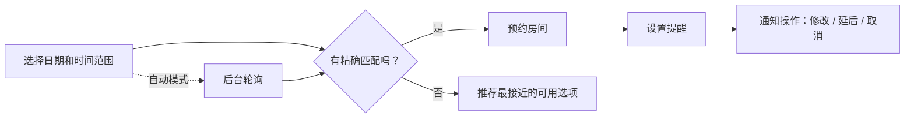

# Tutu-Android

> 一款校园 Android 工具，把零点抢预约的混乱变成了可管理的移动端工作流。

在清华大学，人文图书馆自习室预约是一个虽小却反复出现的系统性问题。房间会按时放出，可用情况变化很快，而一旦错过预约时段，就可能留下违规记录，并被暂时禁止预约。**Tutu-Android** 就是为这个具体场景打造的一款专用助手。

它不是给网页预约门户简单套上一层移动外壳，而是把预约建模为一个 **时间敏感的工作流**：发现可用资源、做出更聪明的选择、快速完成预约、按时收到提醒，并在计划变化时及时补救。用户也可以随时切换账号、退出登录，并直接在应用内提交反馈。

## 核心能力

| 领域 | 应用提供的能力 | 实际价值 |
|---|---|---|
| 标准预约 | 筛选可用房间并手动预约 | 在移动端更快选房 |
| 智能预约 | 选择日期和时间范围；应用搜索最匹配的房间 | 减少反复试错 |
| 自动预约 | 后台轮询监控新释放的可用时段并自动预约 | 不用再参与零点刷新竞赛 |
| 预约管理 | 修改或取消现有预约 | 离开电脑也能处理 |
| 馆内实时状态 | 实时查询自习座位余量 | 避免白跑一趟 |
| 提醒通知 | 在开始前 15 到 30 分钟提醒，并可在通知栏直接快速操作 | 有助于避免爽约和处罚 |
| 个人信息与反馈 | 查看账号和学生信息；在应用内反馈 Bug 或建议 | 让工具更适合日常使用 |

## 预约流程

## 为什么它有效

产品价值来自 **自动化**、**推荐** 与 **情境感知** 的组合。

- **智能预约** 让用户表达的是自己想在 *什么时候* 学习，而不只是从看到的房间里先随手挑一个。
- **自动预约** 把稀缺资源问题变成了监控问题：应用替用户持续盯守，无需自己熬夜刷新页面。
- **通知操作** 让系统更有韧性。如果计划有变，用户无需重新打开完整应用，也能迅速处理。
- **座位余量查询** 解决的是另一个相邻问题：现在到底值不值得去图书馆。

这些功能组合在一起，让应用更像一个面向特定场景的助手，而不是现有预约网站的简单客户端。

## 范围与限制

最初版本支持人文图书馆的 **单人自习室**。多人讨论室已在规划中，但当时尚未实现。应用在快速滚动时也存在一些 UI 小瑕疵，不过不影响正常使用。

当时的路线图很务实：

1. 增加对多人讨论室的支持；
2. 修复剩余的 UI 边界问题；
3. 改进视觉设计与交互打磨；
4. 视情况开放个人资料编辑与违规记录查询；
5. 增加离座计时器，帮助用户避免长时间离开图书馆座位。

## 回顾

作为作品集项目，Tutu-Android 是一个围绕真实制度性瓶颈构建产品的好例子。有意思的部分不在于视觉上有多精致，而在于识别用户会在哪些环节浪费时间、在哪些环节犯错，然后把这些失败点直接转化为产品能力：筛选、推荐、轮询、提醒，以及一键补救操作。

简而言之，这个应用把原本脆弱的网页预约流程，转化为一套更可靠、真正服务校园生活的 Android 预约工作流。
