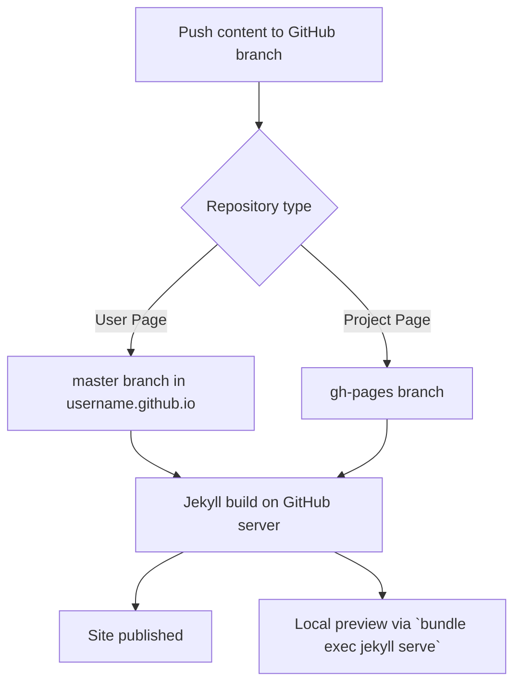

## Overview
GitHub Pages supports static sites powered by [Jekyll](https://jekyllrb.com), a straightforward, blog-aware static site generator. Jekyll enables site-wide components like headers and footers without page-by-page duplication, plus offers advanced templating capabilities.

### How GitHub Pages Uses Jekyll
- **User Pages:** Push content to the `master` branch of the `username.github.io` repository.
- **Project Pages:** Push content to the `gh-pages` branch in your project repository.

Since plain HTML is valid Jekyll syntax, existing sites can immediately leverage Jekyll’s templating without modifying current files.

---

## Installing Jekyll Locally
To preview and debug your site before publishing, install Jekyll locally, matching GitHub Pages environment to avoid deployment discrepancies.

| Requirement | Description | Installation Check |
|-|-|-|
| Ruby | Jekyll is built on Ruby. MacOS often pre-installs Ruby. Version 1.9.3 or newer required. | `ruby --version` |
| Bundler | Ruby dependency manager, simplifies package version control for GitHub Pages projects. | `gem install bundler` if missing |
| Jekyll | Install via `bundle install` with `Gemfile` including `gem 'github-pages'` for consistent dependency versions. | Create `Gemfile` with content:
```bash
source 'https://rubygems.org'
gem 'github-pages'
```
Then run `bundle install` |

Skip Bundler? You can `gem install github-pages`, but this may cause issues later.

---

## Running Jekyll Locally
Navigate to your repository root (switch to `gh-pages` branch for project sites), then run:

```bash
bundle exec jekyll serve
```

This starts a local server (default: http://localhost:4000), mirroring GitHub’s build environment closely. See the [Jekyll commands](https://jekyllrb.com/docs/usage/) for full details.

---

## Keeping Jekyll Updated
Jekyll evolves rapidly. To keep local versions aligned with GitHub Pages:

```bash
bundle update
# or if not using Bundler:
gem update github-pages
```

Otherwise, your local preview may differ from the live site.

---

## Configuring Jekyll
Create or edit the `_config.yml` file in your site root for centralized configuration.

### Default GitHub overrides you cannot change:

```yaml
safe: true
lsi: false
source: your top-level directory
```

*Note:* Changing `source` can break your site builds, as GitHub only serves from the repository's root directory.

### Default values GitHub sets (which you can override):

```yaml
highlighter: pygments
github: [Repository metadata]
```

See [GitHub Pages repository metadata](https://help.github.com/articles/repository-metadata-on-github-pages/) for details.

---

## Frontmatter Essentials
Jekyll requires YAML frontmatter at the top of Markdown files to specify metadata.

```yaml
---
title: My Page Title
layout: post
---

Content goes here.
```

You may omit metadata but still must include `---` delimiters:

```yaml
---
---

Content without metadata.
```

Files inside the `_posts` directory can omit these dashes entirely.

---

## Troubleshooting
If after pushing to GitHub, your site fails to render correctly:

- Run Jekyll locally using the **same versions** of Jekyll and dependencies as GitHub Pages.
- Update with:

```bash
bundle update github-pages
# or
gem update github-pages
```

- Avoid naming conflicts in categories and project names to prevent path collisions.

See [Troubleshooting GitHub Pages build failures](https://help.github.com/articles/troubleshooting-github-pages-build-failures/) for more.

---

## Disabling Jekyll
To bypass Jekyll entirely (e.g., when using directories starting with underscores that Jekyll excludes), add a file named `.nojekyll` at the root of your repository and push it.

---

## Contributing
Jekyll is actively maintained and open source. Contributions are welcome via GitHub:

- Fork the repo: https://github.com/jekyll/jekyll
- Submit pull requests to improve or add features.

---

### Mermaid Diagram: Jekyll Workflow on GitHub Pages

