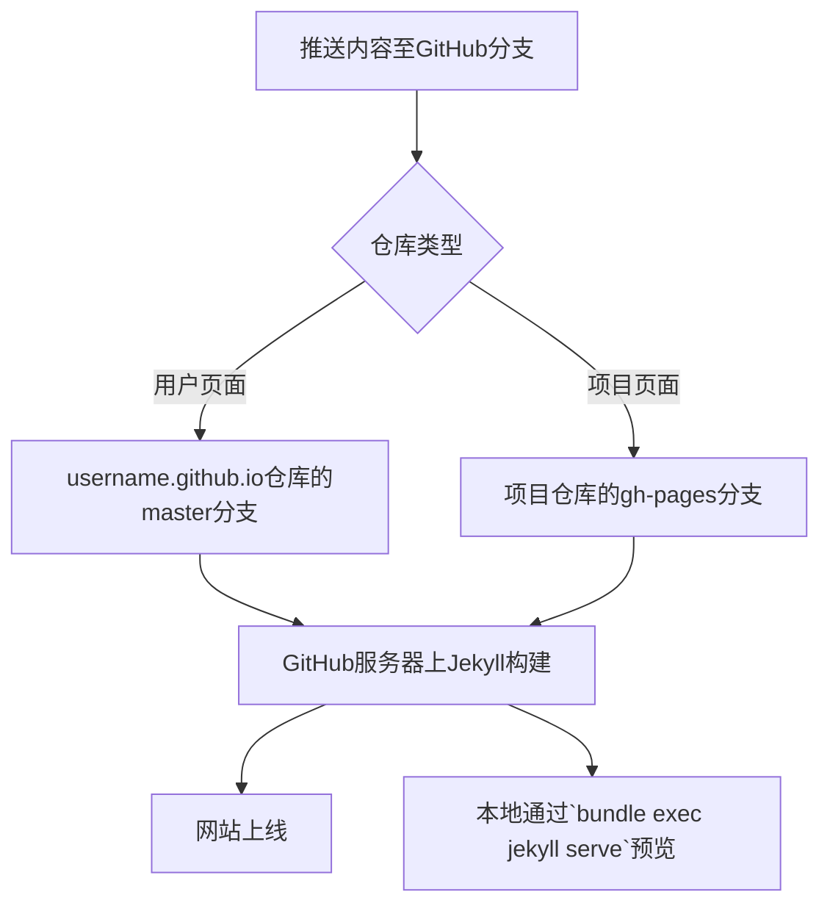

## 概述
GitHub Pages支持基于[Jekyll](https://jekyllrb.com) 的静态网站构建。Jekyll是一个简单且博客感知的静态网站生成器，方便你在各页面复用全局头部和尾部，同时提供丰富的模板功能。

### GitHub Pages如何使用Jekyll
- **用户页面**：将内容推送到`username.github.io`仓库的`master`分支。
- **项目页面**：将内容推送到项目仓库的`gh-pages`分支。

因为常规HTML本身也是Jekyll支持的格式，无需修改即可享受Jekyll模板带来的便利。

---

## 本地安装Jekyll
建议在本地安装Jekyll以预览和调试，确保与GitHub Pages服务器环境一致，避免部署差异。

| 必需项 | 说明 | 验证及安装 |
|-|-|-|
| Ruby | Jekyll基于Ruby开发。macOS通常预装。需1.9.3及以上版本。 | 运行`ruby --version` |
| Bundler | Ruby依赖管理工具，方便维护与GitHub Pages一致的版本。 | 若无，执行`gem install bundler` |
| Jekyll | 在项目根目录创建`Gemfile`，并写入`gem 'github-pages'`，再运行`bundle install`安装所有依赖。 | `Gemfile`示例：
```bash
source 'https://rubygems.org'
gem 'github-pages'
```
执行`bundle install` |

如果跳过Bundler，可用`gem install github-pages`安装，但可能遇到依赖问题。

---

## 运行Jekyll本地预览
进入仓库根目录（项目仓库切换到`gh-pages`分支），运行：

```bash
bundle exec jekyll serve
```

启动本地服务器，默认地址http://localhost:4000，可模拟GitHub Pages构建环境。更多命令请参考[Jekyll用法文档](https://jekyllrb.com/docs/usage/)。

---

## 保持Jekyll更新
Jekyll持续迭代，需同步更新本地版本以避免预览与线上表现不一致：

```bash
bundle update
# 或无Bundler时：
gem update github-pages
```

---

## Jekyll 配置
在网站根目录新建或修改`_config.yml`文件，完成大部分个性化配置。

### GitHub Pages 强制覆盖设置（无法更改）：

```yaml
safe: true
lsi: false
source: your top-level directory
```

注意：修改`source`可能导致部署失败，GitHub Pages只识别仓库顶层目录中的内容。

### GitHub提供的默认设置（可覆盖）：

```yaml
highlighter: pygments
github: [仓库元数据]
```

详情参考[GitHub Pages仓库元数据](https://help.github.com/articles/repository-metadata-on-github-pages/)。

---

## Frontmatter格式要求
每个Markdown文档需在顶部添加YAML frontmatter，包含文件元信息。

```yaml
---
title: 我的标题
layout: post
---

正文内容
```

如仅作简单页面，也可省略内容但必须保留分隔符：

```yaml
---
---

正文内容
```

处于`_posts`目录的文件可完全省略该格式。

---

## 问题排查
若推送后网站无法正常显示，可在本地运行Jekyll调试，确保使用与GitHub Pages相同的[Jekyll版本和依赖](https://pages.github.com/versions/)。

```bash
bundle update github-pages
# 或
gem update github-pages
```

避免分类名称与项目名重名引起路径冲突，例如：个人网站有一篇名为`resume`的文章，且同时存在一个名为`resume`的项目。

更多请见[GitHub Pages构建失败排查](https://help.github.com/articles/troubleshooting-github-pages-build-failures/)。

---

## 关闭Jekyll
若不想使用Jekyll，可在仓库根目录添加`.nojekyll`空文件并推送。此举尤其适用于网站包含以“_”开头的文件夹，避免它们被Jekyll忽略。

---

## 贡献Jekyll
Jekyll为活跃开源项目，欢迎贡献功能改进。

- 仓库地址：[Jekyll GitHub](https://github.com/jekyll/jekyll)
- Fork后提交Pull Request即可参与开发。

---

### Mermaid流程图：GitHub Pages的Jekyll工作流

