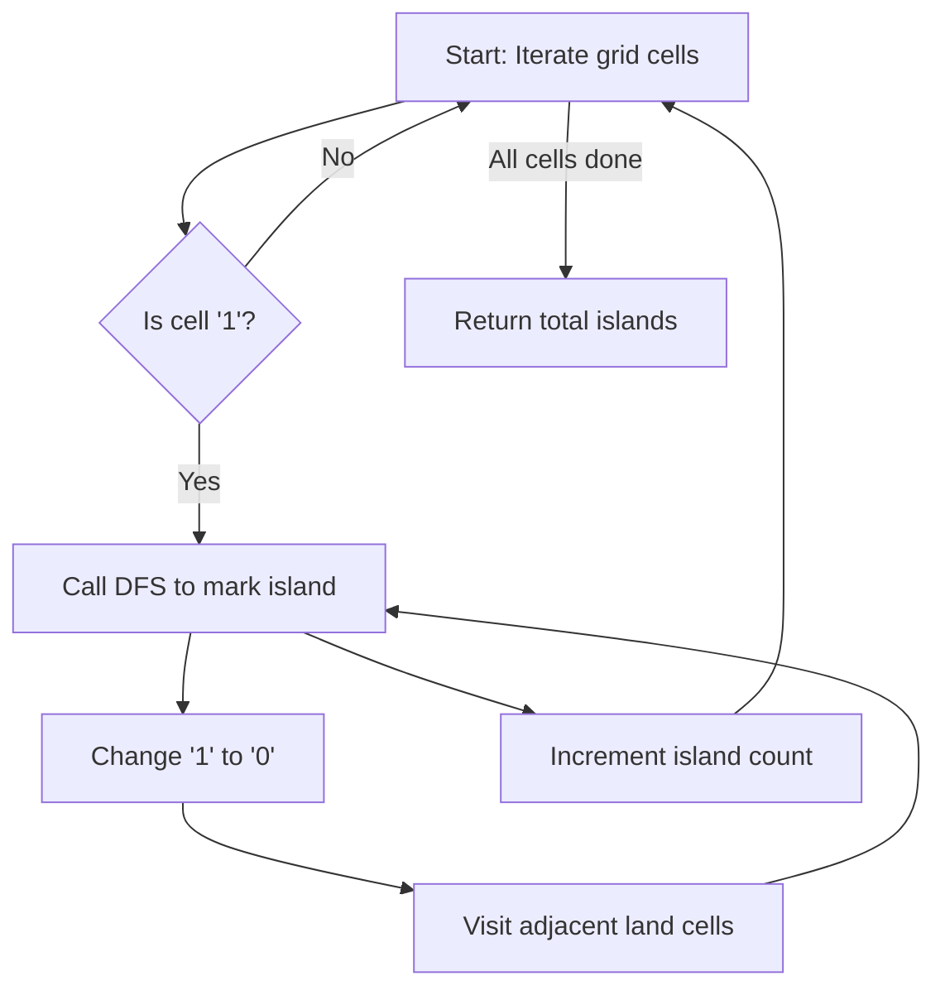

## Problem Overview
LeetCode 200 asks to count the number of islands in a 2D grid, where '1' represents land and '0' water. Islands are groups of horizontally or vertically adjacent lands.

## Core Idea
We iterate through each cell in the grid; when we encounter a land cell ('1'), we initiate a Depth-First Search (DFS) to visit all connected lands. During DFS, we mark visited land cells as '0' to avoid revisiting. Each DFS call corresponds to one island.

## Algorithm Flow


## Code Implementation (C++)
```cpp
class Solution {
public:
    int numIslands(std::vector<std::vector<char>>& grid) {
        int rows = grid.size();
        if (rows == 0) return 0;
        int cols = grid[0].size();
        int islandCount = 0;

        for (int i = 0; i < rows; ++i) {
            for (int j = 0; j < cols; ++j) {
                if (grid[i][j] == '1') {
                    dfs(grid, i, j);
                    ++islandCount;
                }
            }
        }

        return islandCount;
    }

private:
    void dfs(std::vector<std::vector<char>>& grid, int i, int j) {
        static const int directions[4][2] = {{1,0}, {0,1}, {-1,0}, {0,-1}};
        int rows = grid.size(), cols = grid[0].size();
        grid[i][j] = '0';  // Mark visited

        for (const auto& dir : directions) {
            int ni = i + dir[0], nj = j + dir[1];
            if (ni >= 0 && ni < rows && nj >= 0 && nj < cols && grid[ni][nj] == '1') {
                dfs(grid, ni, nj);
            }
        }
    }
};
```

## Notes
- Ensuring grid is non-empty is critical to avoid out-of-bounds errors.
- Modifying the input grid in-place optimizes space usage by marking visited cells.
- DFS is well-suited here as islands are naturally connected clusters.

This approach guarantees each island is counted exactly once with a time complexity of O(m*n), where m and n are grid dimensions.
