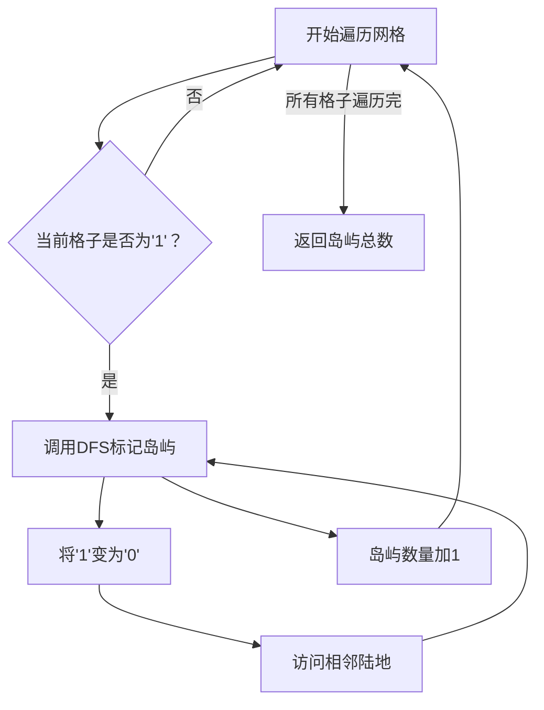

## 问题概述
LeetCode 200 题要求统计二维网格中岛屿的数量，其中 '1' 表示陆地，'0' 表示水域。岛屿由水平或垂直相邻的陆地组成。

## 核心思路
遍历网格中的每个格子，遇到陆地（'1'）时，启动深度优先搜索（DFS）递归访问所有相连陆地，并将遍历过的陆地标记为 '0' 避免重复遍历。每次启动 DFS 相当于识别出一个独立岛屿。

## 算法流程


## 代码实现（C++）
```cpp
class Solution {
public:
    int numIslands(std::vector<std::vector<char>>& grid) {
        int rows = grid.size();
        if (rows == 0) return 0;
        int cols = grid[0].size();
        int islandCount = 0;

        for (int i = 0; i < rows; ++i) {
            for (int j = 0; j < cols; ++j) {
                if (grid[i][j] == '1') {
                    dfs(grid, i, j);
                    ++islandCount;
                }
            }
        }

        return islandCount;
    }

private:
    void dfs(std::vector<std::vector<char>>& grid, int i, int j) {
        static const int directions[4][2] = {{1,0}, {0,1}, {-1,0}, {0,-1}};
        int rows = grid.size(), cols = grid[0].size();
        grid[i][j] = '0'; // 标记已访问

        for (const auto& dir : directions) {
            int ni = i + dir[0], nj = j + dir[1];
            if (ni >= 0 && ni < rows && nj >= 0 && nj < cols && grid[ni][nj] == '1') {
                dfs(grid, ni, nj);
            }
        }
    }
};
```

## 备注
- 检查网格非空以避免越界错误。
- 通过原地修改网格实现空间优化。
- DFS适合处理此类连通块问题。

该算法时间复杂度为 O(m*n)，保证每个岛屿仅被统计一次。
