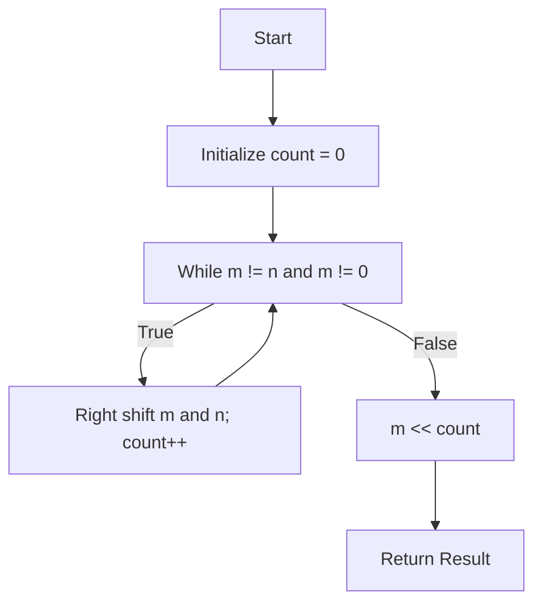

## Problem Overview

Given two integers m and n, compute the bitwise AND of all numbers in the inclusive range [m, n]. A naive solution that applies the AND operation sequentially is inefficient for large ranges.

## Key Insight

Observe the binary representations of numbers in a range—for example, [12, 15]:

| Number | Binary        | Right Shift x1 | Right Shift x2 |
|--------|---------------|----------------|----------------|
| 12     | 1100          | 110            | 11             |
| 13     | 1101          | 110            | 11             |
| 14     | 1110          | 111            | 11             |
| 15     | 1111          | 111            | 11             |

By repeatedly right-shifting both m and n until they become equal, we remove differing lower bits where zeros appear and preserve the common high bits that remain stable. Here, after two shifts, both 12 and 15 become `11` (binary for 3). The original range's bitwise AND is then this value shifted back left two times: `11 << 2 = 1100` (decimal 12).

### Why this works
- Lower bits differ due to the presence of zeros in the range causing those bits in the final AND to reset to 0.
- Only the shared high-order prefix bits remain unchanged after the shifts.

## Algorithm

1. Initialize a counter `count = 0` to track the number of right shifts.
2. While `m != n` and `m != 0`, right shift both `m` and `n` by 1 and increment `count`.
3. After the loop, left shift `m` back by `count` bits to reconstruct the AND result.
4. If `m` becomes 0 during shifting, return 0 immediately since the AND result will be zero.

## Code Implementation (C++)

```cpp
class Solution {
public:
    int rangeBitwiseAnd(int m, int n) {
        int count = 0;
        while (m != n && m != 0) {
            m >>= 1;
            n >>= 1;
            count++;
        }
        return m << count;
    }
};
```

## Notes
- The key optimization is only to consider the two boundary numbers rather than iterating over the entire range.
- When `m` reduces to zero, stop immediately as the AND must be zero.

---

## Mermaid Diagram: High-Level Algorithm Flow



This approach efficiently computes the bitwise AND over a numeric range by identifying and preserving the common bit prefix.
