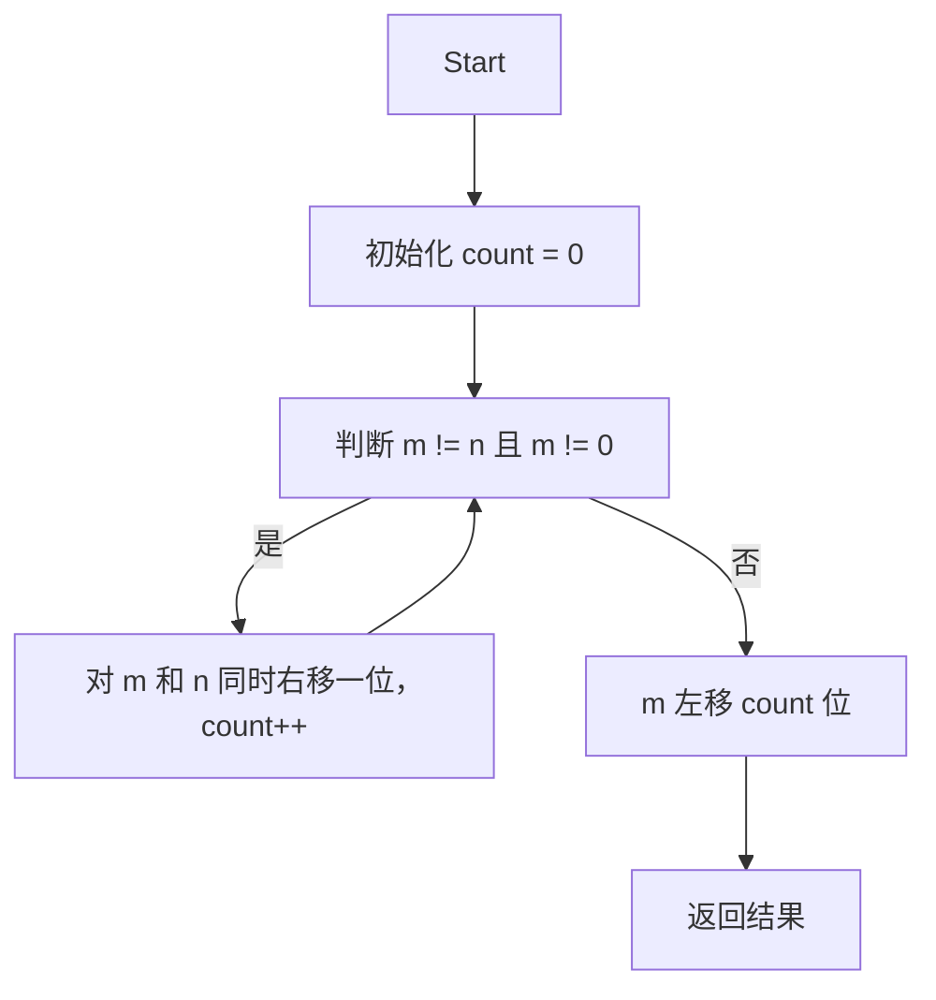

## 问题概述

给定区间端点 m 和 n，求闭区间 [m, n] 内所有整数的按位与。对整个区间逐个计算显然效率低下，尤其当区间很大时。

## 核心思想

观察区间内数字的二进制表示，例如区间 [12, 15]：

| 数字 | 二进制       | 右移1位        | 右移2位       |
|------|--------------|---------------|--------------|
| 12   | 1100         | 110           | 11           |
| 13   | 1101         | 110           | 11           |
| 14   | 1110         | 111           | 11           |
| 15   | 1111         | 111           | 11           |

对区间端点 m 和 n 重复右移，直到它们相等时，即找到了二者相同的高位前缀。移除的低位部分之所以被替换成0，是因为在范围内存在导致这些位置至少有一个0的数字。这里，经过两次右移，12 和 15 都变成了二进制的 `11`（十进制3）。最后结果是该值左移回去两位，即 `11 << 2 = 1100`（十进制12）。

### 结论
- 低位因为存在不同数字的0，最终结果该位为0。
- 只有最高公共前缀部分（高位）保留。

## 算法步骤

1. 初始化计数器 `count = 0`，统计右移次数。
2. 循环条件：当 `m != n` 且 `m != 0` 时，将 `m`，`n` 同时右移 1 位，`count++`。
3. 循环结束后，将 `m` 左移 `count` 位，得到最终结果。
4. 当 `m` 移位后为0，说明最终结果是0，可直接返回。

## 代码示例（C++）

```cpp
class Solution {
public:
    int rangeBitwiseAnd(int m, int n) {
        int count = 0;
        while (m != n && m != 0) {
            m >>= 1;
            n >>= 1;
            count++;
        }
        return m << count;
    }
};
```

## 注意事项
- 优化的关键是只对区间两个端点 m 和 n 操作，而非遍历区间所有数。
- 当 m 右移过程中变成0，直接返回0。

---

## Mermaid 流程图：算法步骤



该方法通过寻找区间端点的公有高位前缀，实现了有效的范围内按位与操作计算。
