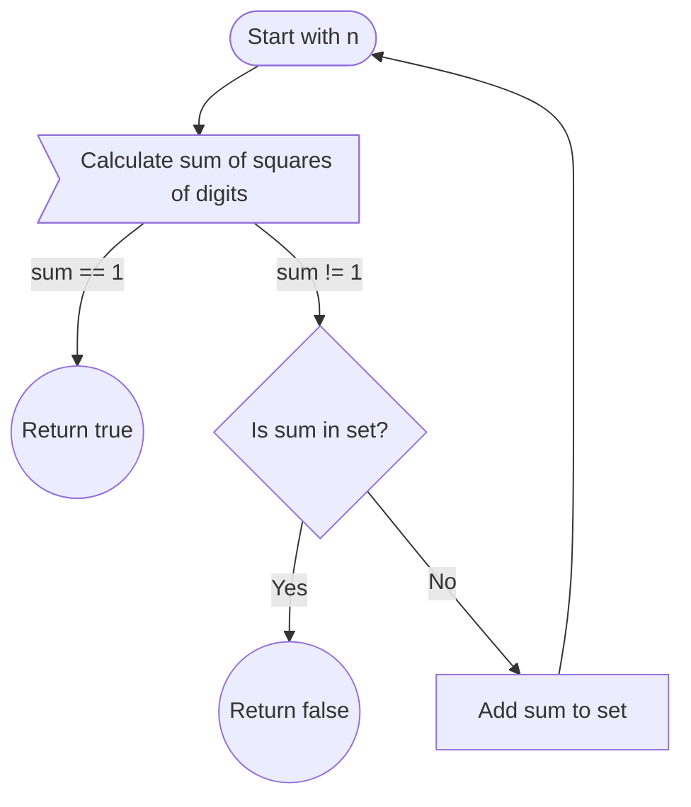

## Overview
The Happy Number problem asks whether starting from a given integer *n*, repeatedly replacing the number by the sum of the squares of its digits eventually results in 1.

If during this process the number cycles without reaching 1, it is not a Happy Number. For example, the cycle:

```
4 → 16 → 37 → 58 → 89 → 145 → 42 → 20 → 4 → ...
```

indicates an infinite loop without reaching 1.

## Key Concepts
- **Termination condition:** If intermediate sum becomes 1, return **true**.
- **Cycle detection:** If a sum repeats (other than 1), it means the process is stuck in a loop, return **false**.
- Use a hash set (`unordered_set<int>`) to record seen numbers, ensuring O(1) average lookups.

For a deep dive into Happy Numbers, see [Happy Number on Wikipedia](http://en.wikipedia.org/wiki/Happy_number). The article also covers related concepts like Happy Primes and Harshad numbers.

---

## Algorithm Flow (Mermaid Diagram)



---

## Clean C++ Implementation
```cpp
#include <unordered_set>
using namespace std;

class Solution {
public:
    bool isHappy(int n) {
        unordered_set<int> seen;
        seen.insert(n);

        while (n != 1) {
            int sum = 0;
            while (n > 0) {
                int digit = n % 10;
                n /= 10;
                sum += digit * digit;
            }
            if (seen.count(sum)) {
                return false;  // cycle detected
            }
            seen.insert(sum);
            n = sum;
        }
        return true;
    }
};
```

**Notes:**
- Using `unordered_set` optimizes cycle detection compared to vector or list.
- The solution gracefully handles any input within the problem constraints.

---
