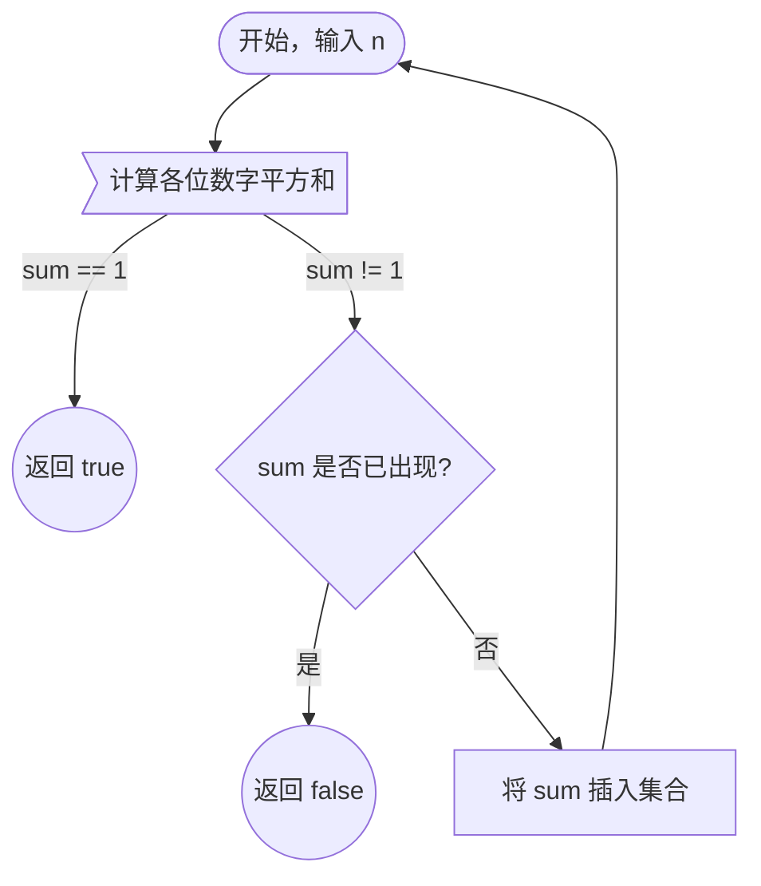

## 概述
快乐数问题判断对给定整数 *n*，不断替换为其各位数字平方和，最终是否能变为1。

若过程中出现循环且不包含1，则不是快乐数。例：

```
4 → 16 → 37 → 58 → 89 → 145 → 42 → 20 → 4 → ...
```

显示了无限循环，永远不会到达1。

## 关键思想
- <u>终止条件：</u> 当计算结果为1时，返回**true**。
- <u>环检测：</u> 若中间结果重复出现（且不为1），说明陷入循环，返回**false**。
- 使用哈希集合（`unordered_set<int>`）存储出现过的数字，以保证查找效率为O(1)平均复杂度。

想深入了解快乐数，可参阅[维基百科快乐数条目](http://en.wikipedia.org/wiki/Happy_number)。其中也介绍了快乐素数(Happy primes)和哈斯哈德数(Harshad number)的相关知识。

---

## 算法流程（Mermaid图示）



---

## 清晰的 C++ 实现
```cpp
#include <unordered_set>
using namespace std;

class Solution {
public:
    bool isHappy(int n) {
        unordered_set<int> seen;
        seen.insert(n);

        while (n != 1) {
            int sum = 0;
            while (n > 0) {
                int digit = n % 10;
                n /= 10;
                sum += digit * digit;
            }
            if (seen.count(sum)) {
                return false;  // 检测到循环
            }
            seen.insert(sum);
            n = sum;
        }
        return true;
    }
};
```

**注释：**
- 使用`unordered_set`相比向量或链表能更高效检测环。
- 方案适用于题目范围内的任意输入，执行稳定。

---
