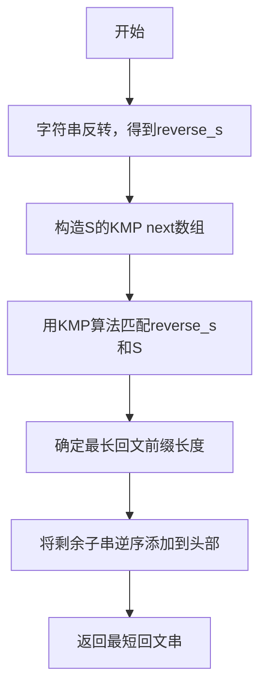

## 题目概述
给定一个字符串 `S`，只能在其**头部添加字符**，使其成为回文字符串。要求返回通过该转换后形成的**最短回文串**。

### 示例
- 输入：`"aacecaaa"`
  - 输出：`"aaacecaaa"`

- 输入：`"abcd"`
  - 输出：`"dcbabcd"`

## 朴素分析
最初的想法是将字符串反转得到 `reverse_s`，尝试找到 `S` 的最长前缀，在 `reverse_s` 中作为后缀匹配，这其实是模式匹配的问题，其中 `S` 是模式串，`reverse_s` 是主串。

这种朴素搜索方式的时间复杂度是 O(n²)。

例如 `S = "abcd"`，`reverse_s = "dcba"`，最长匹配的子串以 `a` 结尾：

| reverse_s | d | c | b | **a** | - | - | - |
| --------- | - | - | - | --- | - | - | - |
| S         | - | - | - | **a** | b | c | d |

再如 `S = "aacecaaa"`，`reverse_s = "aaacecaa"`：

| reverse_s | a | a | a | c | e | c | a | a | - |
| --------- | - | - | - | - | - | - | - | - | - |
| S         | - | **a** | **a** | **c** | **e** | **c** | **a** | **a** | a |

## 优化方案：基于KMP的线性算法
核心思路是使用经典的**Knuth–Morris–Pratt (KMP)算法**，将问题复杂度降到 O(n) 。

### 关键改进点
- 使用 `reverse_s` 作为文本，`S` 作为模式串执行KMP匹配。
- 记录匹配状态，当匹配到 `reverse_s` 尾部时结束。
- 记录最后一次匹配成功时在 `S` 中的下标 `mark`，对应最长回文前缀长度。
- 将 `S` 中从 `mark` 到末尾的子串逆序添加到头部，形成最短回文。

### 流程图



## C++代码示例

```cpp
class Solution {
public:
    string shortestPalindrome(string s) {
        if (s.empty()) return s;
        string reverse_s(s);
        reverse(reverse_s.begin(), reverse_s.end());
        int mark = 0;
        vector<int> next(s.size());
        makeNext(s, next);

        int j = 0;
        for (int i = 0; i < reverse_s.size(); ) {
            if (j == -1 || reverse_s[i] == s[j]) {
                ++i; ++j;
                if (i == reverse_s.size()) {
                    mark = j;
                }
            } else {
                j = next[j];
            }
        }
        return mark == s.size() ? s : reverse_s + s.substr(mark);
    }

private:
    void makeNext(const string& s, vector<int>& next) {
        next[0] = -1;
        int j = -1;
        for (int i = 0; i < (int)s.size() - 1; ) {
            if (j == -1 || s[i] == s[j]) {
                ++i; ++j;
                next[i] = (s[i] == s[j]) ? next[j] : j;
            } else {
                j = next[j];
            }
        }
    }
};
```

### 说明
- `next` 数组是 KMP 的失配函数，用以跳转匹配。
- `mark` 记录最长回文前缀长度。
- 将后缀部分逆序添加保证了最短添加字符数。

通过改造 KMP 算法，以线性时间复杂度快速定位回文前缀，实现最短回文串的构造。
