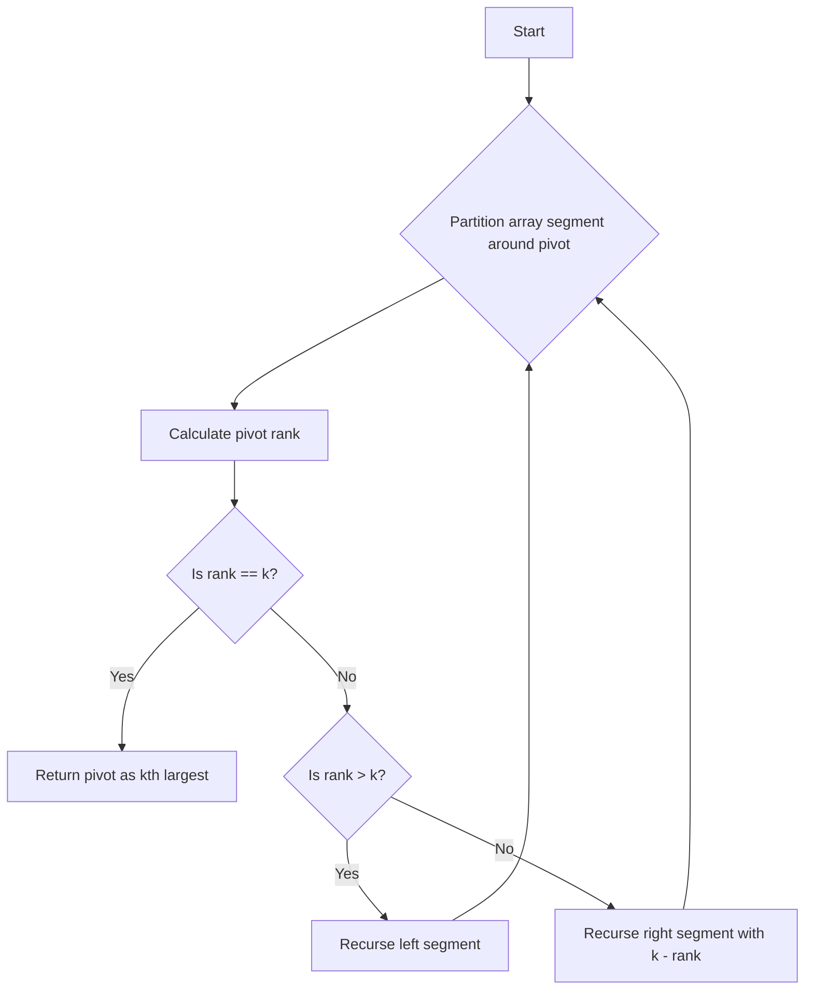

## Problem Overview
Find the **k**th largest element in an unsorted array. Importantly, this refers to the element ranked kth in descending sorted order—not the kth distinct element.

**Example:**
Given the array `[3,2,1,5,6,4]` and `k = 2`, the 2nd largest element is `5`.

Constraints:
- You may assume `k` is always valid, where `1 ≤ k ≤ array length`.

---

## Key Idea: Quickselect Partition
The problem is efficiently solved using a Quickselect algorithm, which shares partitioning logic with QuickSort but only recurses on the side of interest.

**Algorithm Details:**

1. Select the first element of the current segment as the pivot (`save = nums[bottom]`).
2. Partition the array segment so that:
    - Elements greater than `save` are placed on the left.
    - Elements less than or equal to `save` are placed on the right.
3. Calculate the **rank** of the pivot as the number of elements greater than or equal to it in the current segment.
4. Compare `rank` with `k`:
    - If `rank == k`, the pivot is the kth largest element.
    - If `rank > k`, continue searching in the left segment.
    - If `rank < k`, continue searching in the right segment with an adjusted `k - rank`.

This reduces the average runtime to O(n).

---

## Algorithm Flowchart


---

## Code Implementation (C++)
```cpp
class Solution {
public:
    int answer;

    int findKthLargest(vector<int>& nums, int k) {
        quickSelect(nums, 0, nums.size() - 1, k);
        return answer;
    }

private:
    void quickSelect(vector<int>& nums, int left, int right, int k) {
        int i = left, j = right;
        int pivot = nums[left];

        while (i < j) {
            // Move right pointer leftward while elements are <= pivot
            while (i < j && nums[j] <= pivot) --j;
            nums[i] = nums[j];
            // Move left pointer rightward while elements are >= pivot
            while (i < j && nums[i] >= pivot) ++i;
            nums[j] = nums[i];
        }
        nums[i] = pivot;

        int rank = i - left + 1; // rank of pivot in descending order
        if (rank == k) {
            answer = pivot;
            return;
        } else if (rank > k) {
            quickSelect(nums, left, i - 1, k);
        } else {
            quickSelect(nums, i + 1, right, k - rank);
        }
    }
};
```

---

## Summary
By adapting the QuickSort partition method to rearrange elements relative to the pivot for descending order, and by comparing the pivot rank against k, the Quickselect efficiently finds the kth largest element in average linear time.

This approach is a staple interview algorithm and a powerful tool for order statistics in arrays.
