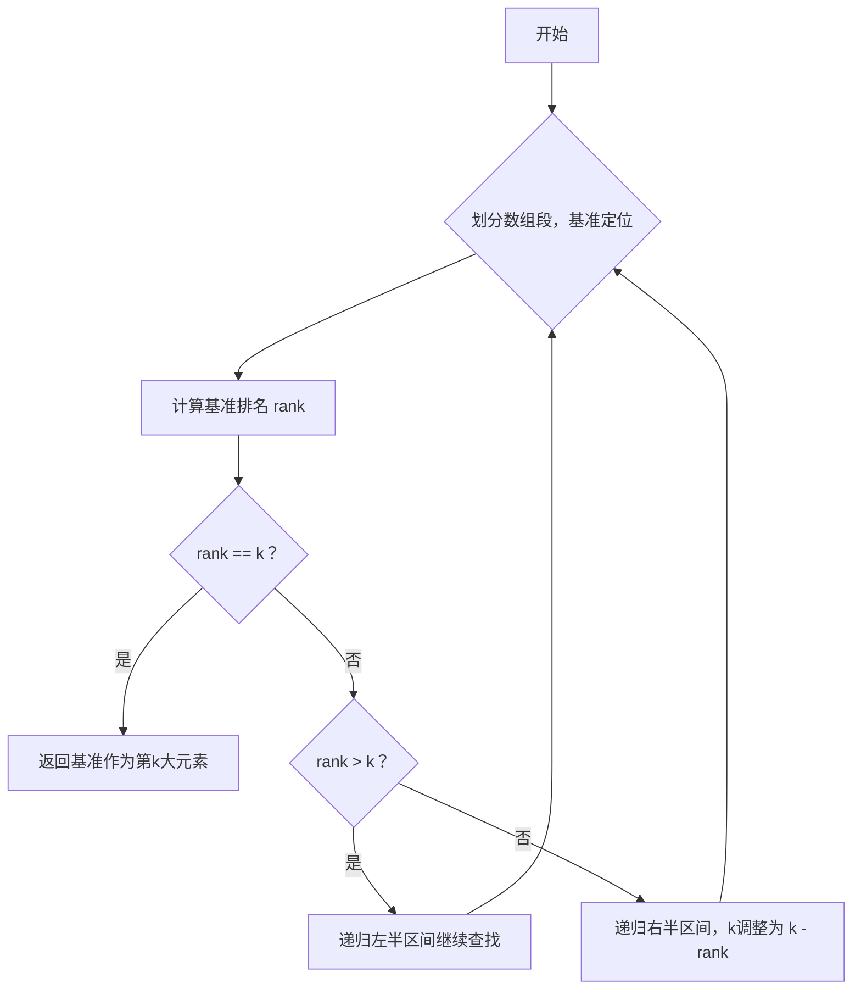

## 题目概述
在无序数组中找到第**k**大的元素。注意，这里的“第k大”是指排序后位置为第k的元素，而非第k个不同的元素。

**示例:**
给定数组 `[3,2,1,5,6,4]` 和 `k = 2`，返回第2大的元素 `5`。

约束条件：
- 可假设 `k` 总是有效，满足 `1 ≤ k ≤ 数组长度`。

---

## 关键思想：快速选择划分
本题采用快速选择（Quickselect）算法，利用快速排序的划分思想，但只递归感兴趣的一侧。

**算法步骤:**

1. 选择当前区间第一个元素作为基准 `save = nums[bottom]`。
2. 对区间内元素进行划分：
    - 大于 `save` 的放左侧，
    - 小于等于 `save` 的放右侧。
3. 计算基准元素在当前区间的排名 `rank`，即大于等于基准的元素数量。
4. 根据 `rank` 与 `k` 比较判断：
    - `rank == k`，基准即为第k大元素，返回。
    - `rank > k`，递归左区间查找。
    - `rank < k`，递归右区间查找，新的k调整为 `k - rank`。

该方法平均时间复杂度为 O(n)。

---

## 算法流程图


---

## 代码实现 (C++)
```cpp
class Solution {
public:
    int answer;

    int findKthLargest(vector<int>& nums, int k) {
        quickSelect(nums, 0, nums.size() - 1, k);
        return answer;
    }

private:
    void quickSelect(vector<int>& nums, int left, int right, int k) {
        int i = left, j = right;
        int pivot = nums[left];

        while (i < j) {
            // 右指针向左移动找到大于基准的元素
            while (i < j && nums[j] <= pivot) --j;
            nums[i] = nums[j];
            // 左指针向右移动找到小于基准的元素
            while (i < j && nums[i] >= pivot) ++i;
            nums[j] = nums[i];
        }
        nums[i] = pivot;

        int rank = i - left + 1; // 基准元素排名
        if (rank == k) {
            answer = pivot;
            return;
        } else if (rank > k) {
            quickSelect(nums, left, i - 1, k);
        } else {
            quickSelect(nums, i + 1, right, k - rank);
        }
    }
};
```

---

## 总结
本算法通过修改快速排序划分，使元素相对于基准按降序排列，并用基准排名判断搜索方向，达到平均线性时间内定位第k大元素的效果。

该解法是面试中经典的顺序统计问题解决方案，也是处理数组选取第k大（小）元素的高效工具。
