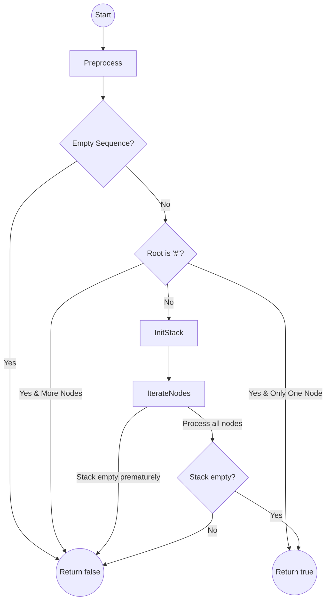
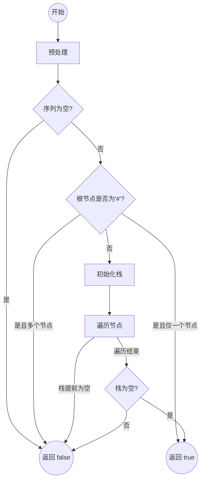

## Problem Overview

Given a preorder serialization string of a binary tree, determine if it represents a valid binary tree. Null nodes are represented by "#" and nodes are separated by commas.

## Key Idea: Stack with Child State Tracking

- Maintain a stack where each element is a boolean indicating the visitation state of children of a node:
  - `true`: both children are not yet seen (waiting for left child).
  - `false`: left child already processed, waiting for right child.

- Algorithm proceeds by iterating over each node in the preorder sequence:
  - For the incoming node, check the top of the stack:
    - If `true`, change to `false` since left child now visited.
    - If `false`, pop the stack as both children are processed.
  - If the current node is not `#`, push `true` to expect its children.

- If the stack empties prematurely before processing all nodes, the serialization is invalid.

### Special Cases
  - A single `#` means a valid empty tree.
  - Multiple nodes but root is `#` is invalid.

## Algorithm Flow (Mermaid Diagram)



## Code Implementation (C++)

```cpp
#include <string>
#include <vector>
#include <stack>
using namespace std;

class Solution {
public:
    bool isValidSerialization(const string& preorder) {
        vector<string> nodes = preprocess(preorder);
        if (nodes.empty()) return false;
        if (nodes.size() == 1 && nodes[0] == "#") return true;
        if (nodes.size() > 1 && nodes[0] == "#") return false;

        stack<bool> childStateStack; // true: expecting left child, false: expecting right child
        childStateStack.push(true); // root expects left child initially

        for (int i = 1; i < nodes.size(); ++i) {
            if (childStateStack.empty()) return false;

            bool expectLeft = childStateStack.top();
            childStateStack.pop();

            if (expectLeft) {
                childStateStack.push(false); // left child seen, now expect right child
            }

            if (nodes[i] != "#") {
                childStateStack.push(true); // new non-null node expects children
            }
        }

        return childStateStack.empty();
    }

private:
    vector<string> preprocess(const string& s) {
        vector<string> result;
        int start = 0;
        for (int i = 0; i < s.size(); ++i) {
            if (s[i] == ',') {
                result.push_back(s.substr(start, i - start));
                start = i + 1;
            }
        }
        result.push_back(s.substr(start));
        return result;
    }
};
```

## Notes
- This approach avoids reconstructing the tree.
- The stack simulates the expected children dynamically, providing an efficient O(n) solution.
- Preprocessing splits the serialization string by commas for straightforward node iteration.

------

## 中文版本

### 问题概述

给定一个二叉树的前序序列化字符串（用 "," 分隔节点，"#" 表示空节点），判断其是否是有效的二叉树序列化。

### 核心思想：使用栈记录子节点状态

- 利用栈存储布尔值，代表当前节点子节点访问状态：
  - `true`：表示当前节点的两个子节点均未访问（等待左子节点）。
  - `false`：表示左子节点已访问，等待右子节点。

- 遍历序列中的每个节点时：
  - 取栈顶状态：
    - 若为`true`，改为`false`（左子节点访问完）
    - 若为`false`，弹出栈顶（该节点的左右子节点都访问完）
  - 若当前节点不为`#`，则压入`true`表示该节点期望它的子节点

- 若在遍历过程中栈提前空了，说明序列非法。

### 特殊情况
- 仅单个 `#` 表示空树，合法。
- 多个节点但根节点为 `#` 不合法。

### 算法流程（Mermaid 流程图）



### 代码实现（C++）

```cpp
#include <string>
#include <vector>
#include <stack>
using namespace std;

class Solution {
public:
    bool isValidSerialization(const string& preorder) {
        vector<string> nodes = preprocess(preorder);
        if (nodes.empty()) return false;
        if (nodes.size() == 1 && nodes[0] == "#") return true;
        if (nodes.size() > 1 && nodes[0] == "#") return false;

        stack<bool> childStateStack; // true 表示等待左子节点，false 表示等待右子节点
        childStateStack.push(true);  // 根节点开始等待左子节点

        for (int i = 1; i < nodes.size(); ++i) {
            if (childStateStack.empty()) return false;

            bool expectLeft = childStateStack.top();
            childStateStack.pop();

            if (expectLeft) {
                childStateStack.push(false); // 左子节点访问完，等待右子节点
            }

            if (nodes[i] != "#") {
                childStateStack.push(true); // 非空节点，期待它的子节点
            }
        }

        return childStateStack.empty();
    }

private:
    vector<string> preprocess(const string& s) {
        vector<string> result;
        int start = 0;
        for (int i = 0; i < (int)s.size(); ++i) {
            if (s[i] == ',') {
                result.push_back(s.substr(start, i - start));
                start = i + 1;
            }
        }
        result.push_back(s.substr(start));
        return result;
    }
};
```

### 备注

- 该方法无需重建树，仅通过栈模拟节点子女访问状态，时间复杂度为O(n)。
- 预处理步骤负责将序列化字符串按逗号拆分为节点，方便逐个检查。
